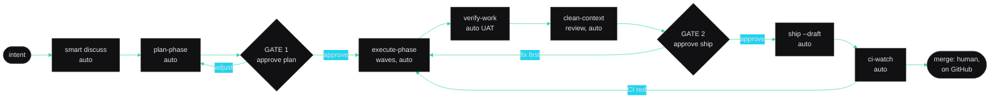

# GSD Autonomous Workflows

**Generated:** 2026-07-11 · **Source of truth:** `.planning/GSD-ECOSYSTEM-MAP.md` (237 components, read from disk this session) + behavioral evidence (400-commit archaeology, `tasks/todo.md` handoffs, `tasks/lessons.md`)
**North star:** *Automate the reversible; gate the irreversible. Autonomy is not skipping verification or safety — it is not requiring the operator to trigger them.*

---

## Executive summary

- **7 named workflows** cover every evidenced operator intent; each is 1 intent in, ≤2 gates, lifecycle runs itself.
- **Surface collapse: 76 user-facing commands → 1 front door (`/gsd:do`, extended) + 7 named flows.** A typical phase drops from 5–6 manual invocations + ~6 scattered decisions to 1 intent + 2 gates.
- **1 of the 7 is already built:** `refresh-ecosystem-map` shipped as `/gsd:ecosystem-map` (commit `375528e`) — its involvement win is banked, not proposed.
- **The always-on safety net is GitHub-side, not hook-side:** on a fresh clone only 1 logging-only hook fires; the 6 installer-wired runtime hooks (2 fail-closed safety gates + 4 monitoring) exist solely on the operator's workstation. Branch protection (5 required checks, PR-only merge) is the load-bearing gate for unattended runs.
- **Top 3 build order:** `wrap-and-sync` → `daily-startup` → `idea-to-shipped` — deliberately not pure score order (`idea-to-shipped` scores #2 but builds third; it needs the smart-discuss extraction first — see Ranked build order).

---

## Autonomy model

| Level | Name | Runs unattended | Human touch | Existing primitive |
|---|---|---|---|---|
| L0 | Manual | nothing | every step | raw `/gsd:*` |
| L1 | Assisted | intent routing | triggers each step | `/gsd:do` (16-row router, `get-shit-done/workflows/do.md:38-56`) |
| L2 | Supervised | multi-phase run, pauses at gates | 1–2 gate approvals | wrapper around a chain |
| L3 | Autonomous | plan→execute→verify→iterate | only the irreversible gate | `/gsd:autonomous`, `/gsd:quick --full` |

### Enabler (a) — the hook safety net, honestly stated

What actually fires during unattended execution depends on where the run happens:

| Layer | Fires from a fresh clone? | Components |
|---|---|---|
| Repo-registered hooks | Yes — but logging-only | `scripts/gsd-agent-health-check.sh` (SubagentStop, always exits 0; registered in `.claude/settings.json`) |
| Installer-wired hooks | **No** — workstation only | `gsd-prompt-guard` (PreToolUse, 23 injection patterns, fail-closed), `gsd-config-protection` (PreToolUse, 32 files, fail-closed), `gsd-context-monitor`, `gsd-cost-tracker`, `gsd-check-update`, `gsd-statusline` — wired by `bin/install.js:4769-4933` into the operator's `~/.claude/settings.json`, never by `git clone` |
| Plugin-conditional | Only if plugin enabled | `mcp-health-check.sh` (SessionStart, `plugins/claude-mcp-ecosystem/workspace-ops/hooks/hooks.json`) |
| Unwired | Never (known gap) | `.claude/hooks/lesson-capture-gate.cjs` (Stop, the one hook that CAN block; inert — `tasks/lessons.md` 2026-04-13) |
| **Remote (clone-independent)** | **Always** | Branch protection on `main`: 5 required status checks + PR-only merges + force-push block; secret-scanning push protection; CodeQL; Dependabot |

Two design consequences, applied to every workflow below: (1) no chain may assume a local hook will catch a mistake — gates are placed as if only the remote net exists; (2) `execute-phase` waves commit with `git commit --no-verify` and defer hooks to a post-wave pass (`execute-phase.md:236-241`), so per-commit hook coverage inside waves is already zero by design. Never remove or weaken any of the above to buy autonomy.

### Enabler (b) — verification is already mostly automated

`/gsd:verify-work` runs automated UAT first (`gsd-tools.cjs uat run-automated` parses `must_haves` from plan frontmatter, generates assertions, produces a pass/fail table — `verify-work.md:152-196`) and holds conversational UAT only for what it can't automate. `gsd-verifier` applies the 4D rubric (security 35 / performance 25 / correctness 25 / maintainability 15). On failures, `diagnose-issues.md` spawns parallel `gsd-debugger` agents automatically. The operator's role in verification is deciding, not driving.

---

## Candidate evidence (what earned a workflow, what didn't)

| Candidate | Trigger intent | Evidence | Frequency | Verdict |
|---|---|---|---|---|
| daily-startup | "where am I / start my day" | 5 dated boot sessions in `tasks/lessons.md` exemptions; every `tasks/todo.md` handoff opens with a prime | per-session | KEEP |
| idea-to-shipped | "turn this idea into shipped code" | discuss→plan→execute→verify→ship chain, 11 occurrences (phases 45–57; unsquashed in 45/47/48, squash-merged after) | per-phase | KEEP |
| bug-to-branch | "just fix this bug" | 8-commit `fix(ci)` cluster (`1b4c9b3`…`34b865b`) — rapid fix iteration with no discuss/plan artifacts | on-demand | KEEP |
| quick-change | "quick change" | `fix(48)` single-file commits outside the pipeline; bounded by lesson 2026-03-25 [Scope] (3+ files ≠ quick) | on-demand | KEEP |
| ship-milestone | "close out the milestone" | 6 milestone-close commits across v2.3–v2.8; `STATE.md:28` names the executed chain verbatim | per-milestone (18 milestones / 43 days) | KEEP |
| wrap-and-sync | "wrap before I stop" | 8 wrap commits; 3 full handoff blocks in `tasks/todo.md`; lesson 2026-05-11 written because this sequence was once skipped (PR #28 CI failure) | per-session | KEEP |
| refresh-ecosystem-map | "refresh the ecosystem map" | Built this session: `375528e`, `af2adba`; map carries an append-only Drift History for repeat runs | on-demand | KEEP (already built) |
| keep-me-safe-while-i-move-fast | "keep me safe while I move fast" | 5 lessons each codify a skipped safety step; `/gsd:ci-watch` caught drift live (2026-05-11 handoff #7) | always-on | KEEP — but it's the safety-net layer + gate placement, not a chain (see Implementation: build nothing) |
| research-and-plan-new-thing | "research + plan a new thing" | discuss/plan artifacts committed separately (`24090d3`, `38c1e61`) | per-phase | FOLDED into idea-to-shipped (same chain, stop at the plan gate) |
| stand-up-agents | "stand up agents for this project" | NOT FOUND as a distinct pattern — only audit/map commits exist | — | DROP |
| dependency-hygiene-sweep | (evidence-added) | One full chain: Dependabot PR → CI → merge → backlog close (`48b81c4`→`6406b0e`→`80e2006`) | on-demand | DEFER — single instance; Dependabot already automates the trigger half |

---

## W1 — `daily-startup`

1. **Name:** `daily-startup`
2. **Trigger intent:** "Where am I? Start my day."
3. **Chain:**
   - `[auto]` `/gsd:prime-patterns` — project boot + KB pattern injection (idempotent)
   - `[auto]` `/gsd:daily` — read-only dashboard: milestone/phase progress, git state, checkpoint freshness, exact next command (`get-shit-done/workflows/daily.md`, calls `get-shit-done/bin/lib/daily.cjs` directly, zero spawns)
   - `[auto]` if a checkpoint or handoff file is present (runtime artifacts `CHECKPOINT.json` / `HANDOFF.json` under `.planning/`): `/gsd:resume-work` context restore (skips its menu; surfaces the routed next command instead)
4. **Autonomy level:** L3 — read-only end to end; the only write is `state/pattern-context.md` (idempotent overwrite).
5. **Checkpoints:** none. Zero-gate is valid: nothing irreversible is touched. The workflow ENDS by presenting the routed next command; choosing to run it is the operator's next intent, not a gate inside this one.
6. **Quality review:** not applicable (no produced artifact).
7. **Involvement reduction:** Before: 3 invocations + 1 routing decision → **After: 1 intent + 0 gates.**
8. **Failure & rollback:** any step failing prints its own error and stops; nothing to roll back. Stale checkpoint (>24h) is flagged, not auto-deleted.

## W2 — `idea-to-shipped`

1. **Name:** `idea-to-shipped`
2. **Trigger intent:** "Turn this idea into shipped code." (Also serves "research + plan a new thing" — say "stop at the plan" and it ends at GATE 1.)
3. **Chain:**
   - `[auto]` smart discuss — batch grey-area proposal tables (the autonomous.md variant), writes CONTEXT.md. `REQUIRES NEW: extraction of smart_discuss from get-shit-done/workflows/autonomous.md into a callable step (its own CTRL-03 note anticipates this)`
   - `[auto]` `/gsd:plan-phase` — spawns `gsd-planner` → `gsd-verifier` plan check → revision loop (≤3)
   - **`[GATE 1]` approve plan**
   - `[auto]` `/gsd:execute-phase --no-transition` — wave-parallel `gsd-executor` (worktree isolation), regression gate, `gsd-verifier` phase-goal verification
   - `[auto]` `/gsd:verify-work` (default mode — schema pre-flight, then automated UAT from `must_haves`; `--mode=schema` would skip the UAT entirely, `verify-work.md:148`); conversational UAT only if automation can't cover an item (surfaces at GATE 2 if so)
   - `[auto]` quality review — clean-context `gsd-verifier` (general scope) on the diff before anything leaves the machine
   - **`[GATE 2]` approve ship**
   - `[auto]` `/gsd:ship --draft` — push + draft PR (gate deliberately sits BEFORE ship: `ship.md`'s own question fires only after the PR exists, `workflow:168-181`)
   - `[auto]` `/gsd:ci-watch` — poll to terminal state; on failure, diagnose (pattern library → LLM fallback) and loop a fix through GATE-2-approved scope
   - Merge: stays human, on GitHub, forever (branch protection). `ship` never merges (`ship.md:219`).
4. **Autonomy level:** L3 — plan→execute→verify→iterate unattended between the two gates.
5. **Checkpoints:**
   - GATE 1 — WHAT_AGENT_PRESENTS: plan summary table (tasks, waves, files touched, `must_haves`) + verifier verdict. WHAT_HUMAN_DECIDES: proceed / edit scope / abandon. FEEDBACK_FORMAT: AskUserQuestion. WHAT_HAPPENS_NEXT: execute waves begin on the current branch. **Prompt text:** *"Plan verified (N tasks, M waves, files: …). Execute now? [Execute / Adjust scope / Stop here — keep the plan]"*
   - GATE 2 — WHAT_AGENT_PRESENTS: verification table (X/Y must-haves passed), diff stat, quality-review verdict, target branch. WHAT_HUMAN_DECIDES: ship / fix first / stop. FEEDBACK_FORMAT: AskUserQuestion. WHAT_HAPPENS_NEXT: push + draft PR + CI watch. **Prompt text:** *"Verification passed (X/Y must-haves; review: PASS). Push branch and open draft PR? [Ship it / Fix issues first / Stop — keep local]"*
6. **Quality review:** clean-context `gsd-verifier` before GATE 2 (step above) — reviewer shares no context with the executors it grades.
7. **Involvement reduction:** Before: 5–6 invocations + ~6 decisions (context confirm, plan approve, checkpoint answers, UAT responses, PR question, merge) → **After: 1 intent + 2 gates** (+ merge on GitHub).
8. **Failure & rollback:** executor failure mid-wave → stop-and-report with `/gsd:pause-work` handoff (never auto-`/gsd:debug` into an unreviewed rewrite); verification `gaps_found` → one auto gap-closure cycle (`plan-phase --gaps` → re-execute), then stop-and-report if gaps persist (mirrors `autonomous.md`'s 1-retry cap). Rollback: branch discard — nothing touches `main`.

## W3 — `bug-to-branch`

1. **Name:** `bug-to-branch`
2. **Trigger intent:** "Just fix this bug." (Pete pastes an error; zero context switching — per CLAUDE.md's autonomous-bug-fixing contract.)
3. **Chain:**
   - `[auto]` `/gsd:debug` — symptom intake from the pasted error, spawns `gsd-debugger` (scientific method, persistent state in `.planning/debug/`)
   - **`[GATE 1]` root cause found → choose fix path** (this is `debug.md:110-116`'s existing gate, kept: the answer changes the downstream path)
   - `[auto]` fix via `/gsd:quick --full` (small) or `/gsd:plan-phase --gaps` → execute (structural)
   - `[auto]` full test suite (`npm test`) — lesson 2026-03-25 [Testing]: whole suite, not just the changed module
   - **`[GATE 2]` approve ship** → `[auto]` `/gsd:ship --draft` + `/gsd:ci-watch`
4. **Autonomy level:** L2 — investigation and fix run unattended; two path-changing decisions stay human.
5. **Checkpoints:**
   - GATE 1 — PRESENTS: root cause + evidence + proposed fix approach with blast radius (files touched). DECIDES: fix now inline / plan it / I'll fix manually. **Prompt text:** *"Root cause: {cause} (evidence: {file:line}). Fix approach: {approach}, touches {N} files. [Fix now / Plan the fix / I'll take it manual]"*
   - GATE 2 — same shape and prompt as `idea-to-shipped` GATE 2.
6. **Quality review:** `--full` verifier on the quick path; phase-goal verifier on the plan path — both clean-context.
7. **Involvement reduction:** Before: 3–4 invocations + 3 decisions → **After: 1 intent (paste the error) + 2 gates.**
8. **Failure & rollback:** `INVESTIGATION INCONCLUSIVE` → stop-and-report with the debugger's state file (resumable); fix fails suite → auto-revert the fix commit on the branch, report. Debug state persists across context resets by design.

## W4 — `quick-change`

1. **Name:** `quick-change`
2. **Trigger intent:** "Quick change: {description}."
3. **Chain:**
   - `[auto]` scope self-check — if the change needs 3+ files, STOP and escalate: lesson 2026-03-25 [Scope] ("not quick — re-plan") routes to `idea-to-shipped`
   - `[auto]` `/gsd:quick --full` — **`--full` is non-negotiable in the bundle**: the default path runs zero automated verification (`quick.md:375-414` vs `:594-609`); planner → executor (worktree) → verifier
   - `[auto]` local atomic commit (reversible — automate)
   - **`[GATE 1]` approve push** → `[auto]` push + draft PR + `/gsd:ci-watch`
4. **Autonomy level:** L2.
5. **Checkpoints:** GATE 1 — PRESENTS: diff stat + verifier verdict + suite result. DECIDES: push or keep local. **Prompt text:** *"Done and verified locally ({files}, {±lines}; suite green). Push and open draft PR? [Push / Keep local / Discard]"*. The escalation stop is a routing decision, not a rubber stamp — it fires only when the 3-file rule trips.
6. **Quality review:** the `--full` verifier (clean context).
7. **Involvement reduction:** Before: 2 invocations + 1 decision → **After: 1 intent + 1 gate.** The win is small per run but the safety delta is large: verification becomes structurally impossible to forget.
8. **Failure & rollback:** verifier gap → one fix iteration, then stop-and-report; rollback = drop the local commit (`git reset --hard HEAD~1` on the working branch, never `main`).

## W5 — `ship-milestone` — BUILT (Phase 59, 2026-07-15)

> **Status: shelved by operator decision (2026-07-12).** A milestone ship is exactly the kind of irreversible sequence that must be gated, and `/gsd:finalize` — the existing primitive closest to this chain — carries two ungated pushes plus a tool-permission mismatch (details in item 8). The design below already routes around `finalize`, but this workflow stays unbuilt until `finalize` is repaired or the chain is re-verified end-to-end. Spec retained for that day.
>
> **Update (2026-07-12, blueprint `finalize-push-consent`):** the two ungated pushes (Gate 1 and Gate 7) and the missing AskUserQuestion in `allowed-tools` are resolved — both pushes now sit behind a consent gate: AskUserQuestion when interactive; the `--yes-push` flag or the `workflow.finalize_auto_push` config key (default `false`) pre-approve it for autonomous chains, always printing an `[auto-push]` receipt. `ship-milestone` can now route THROUGH `finalize` by granting push consent at its own approved gate. ~~Still open before unshelving: the cross-plugin `repo-doc-architect` spawn (Gate 5.5) and one end-to-end chain re-verification.~~
>
> **Update (2026-07-15, Phase 59): BUILT.** `get-shit-done/workflows/ship-milestone.md` implements the spec below verbatim — same chain, same 2 gates, same prompt texts — registry-routable as `workflow:ship-milestone` (blind spot-check 3/3: close-out intent routes here; phase-level ship still routes to ship-and-merge; an explicit complete-milestone ask still reaches the primitive). Structural contract: `tests/ship-milestone.test.cjs`. Autonomy stays L2 by design. The shelf is lifted.
>
> **Update (2026-07-15, Phase 58 — FIN-01/FIN-02):** both remaining preconditions are resolved. Gate 5.5 now checks agent availability first and degrades gracefully — `[skip]` notice (naming the closeout-deferred-drift caveat) and continue to Gate 6 when `repo-doc-architect` doesn't resolve; spawn contract unchanged when it does (locked by `tests/finalize.test.cjs`). The full 8-gate chain was re-verified end-to-end twice in a sandbox (fixture project + local bare origin): interactive consent prompts fired live at Gates 1 and 7, `[auto-push]` receipts printed under `--yes-push`, Gate 2 hard-stop proven against an injected build failure, zero ungated remote operations in the origin audit (evidence: `.planning/phases/58-finalize-hardening/VERIFICATION.md`, summarized in the Phase 58 PR). **No open unshelve preconditions remain — W5 is buildable; Phase 59 builds it.**

1. **Name:** `ship-milestone`
2. **Trigger intent:** "Close out the milestone."
3. **Chain** (the proven finalizer critical path, `STATE.md:28`, 6 occurrences):
   - `[auto]` `/gsd:health` (read-only validate; `--repair` only via its own existing prompt)
   - `[auto]` `/gsd:audit-agents --no-commit` → `gsd-ecosystem-auditor` verdict
   - `[auto]` `/gsd:sync-docs` — living-docs refresh (line-cited diffs)
   - `[auto]` `npm run test:coverage` + `node scripts/check-doc-drift.cjs` — lesson 2026-05-11: re-run AFTER the last change, same commit unit
   - `[auto]` `/gsd:audit-milestone` → `gsd-verifier` (integration scope), 3-source requirements cross-reference
   - **`[GATE 1]` audit verdict** (only if not `passed` — a `passed` audit auto-continues; a forced pause on green would be a rubber stamp)
   - `[auto]` `/gsd:ship` for any unshipped docs branch + `/gsd:ci-watch` to green
   - **`[GATE 2]` complete milestone** — tag + archive + branch handling
   - `[auto]` `/gsd:complete-milestone {version}` — its 3 internal prompts (archive phases `workflow:390`, branch handling `workflow:572`, tag push `workflow:669`) **still fire and stay human**; GATE 2 authorizes starting the sequence, never auto-answering branch deletion or tag push
4. **Autonomy level:** L2 — irreversible cluster at the end (tag push, branch deletion, archive) keeps this supervised.
5. **Checkpoints:**
   - GATE 1 (conditional) — PRESENTS: audit status + gap/tech-debt summary. DECIDES: accept and continue / stop and fix. **Prompt text:** *"Milestone audit: {status}. {N} gaps / {M} tech-debt items: {summary}. [Continue anyway / Stop — fix first]"*
   - GATE 2 — PRESENTS: everything about to become permanent — tag name, branches to squash/delete, archive destination, requirements score. DECIDES: complete or hold. **Prompt text:** *"Ready to complete {version}: tag v{X.Y} + push, squash-merge {branch}, archive {N} phases. This is the irreversible step. [Complete milestone / Hold]"*
6. **Quality review:** the audit IS the review (integration-scope verifier + 3-source cross-reference).
7. **Involvement reduction:** Before: 9 invocations + ~6 decisions → **After: 1 intent + 2 gates** (1 when the audit is green) **+ `complete-milestone`'s 3 internal prompts** (archive / branch / tag push — kept human by design, so the honest decision count is 2 + 3, down from ~6, with zero invocations to drive).
8. **Failure & rollback:** audit `gaps_found` → GATE 1; anything failing before GATE 2 leaves the milestone open and resumable — nothing irreversible has happened yet. **Exclusion of `/gsd:finalize` — RESOLVED (2026-07-15):** the three original blockers are all fixed — the two pushes sit behind consent gates (Gate 1 push at `finalize.md:81`, Gate 7 push at `finalize.md:164`; blueprint `finalize-push-consent`), `allowed-tools` includes AskUserQuestion, and the Gate 5.5 `repo-doc-architect` spawn (`finalize.md:~145`) degrades gracefully when `claude-mcp-ecosystem` isn't enabled (Phase 58, FIN-01). `finalize` is safe to compose into the chain.

## W6 — `wrap-and-sync`

1. **Name:** `wrap-and-sync`
2. **Trigger intent:** "Wrap before I stop."
3. **Chain** (codifies lesson 2026-05-11 [Pre-Push Validation / Drift] end to end):
   - `[auto]` `npm run test:coverage` — fresh measurement after the session's last change
   - `[auto]` `node scripts/check-doc-drift.cjs` — if drift: update `CLAUDE.md` / `README.md` / `docs/DEVOPS-HANDOFF.md` to measured values, same commit unit
   - `[auto]` refresh `.planning/STATE.md` + `tasks/todo.md` session-handoff block
   - `[auto]` lessons check — if the session contained an operator correction, append `tasks/lessons.md`; else log a dated exemption line (the unwired `lesson-capture-gate.cjs` contract, done by the workflow instead of the inert hook)
   - `[auto]` `/gsd:checkpoint` — deterministic `CHECKPOINT.json` for next session's `daily-startup`
   - `[auto]` `/gsd:session-report`
   - **`[GATE 1]` approve the wrap commit** — honors lesson 2026-04-10 [Hook Design]: never force-commit past a review-pending state
   - `[auto]` commit (single unit) + push + draft PR (branch protection forbids direct `main` pushes)
4. **Autonomy level:** L3 — everything before the gate is docs/state on a branch, fully reversible.
5. **Checkpoints:** GATE 1 — PRESENTS: files in the wrap commit, drift fixes applied, lesson captured-or-exempted, coverage/test numbers. DECIDES: commit+push, commit local only, or discard. **Prompt text:** *"Wrap ready: {files} ({drift summary}; lessons: {captured/exempt}). Commit and push? [Commit + push / Commit local only / Discard]"*
6. **Quality review:** `check-doc-drift.cjs` is the machine reviewer here (23 numeric claims vs live measurement) — the same check CI's `docs-integrity` gate will re-run.
7. **Involvement reduction:** Before: 5 invocations + 2 decisions (and historically, 1 forgotten step = PR #28's CI failure) → **After: 1 intent + 1 gate.**
8. **Failure & rollback:** coverage run fails → report, wrap continues without doc updates (drift check impossible — say so, don't guess); nothing is committed until the gate approves, so rollback = walk away.

## W7 — `refresh-ecosystem-map` — ALREADY BUILT

1. **Name:** `refresh-ecosystem-map` → shipped as **`/gsd:ecosystem-map`** (`commands/gsd/ecosystem-map.md` + `get-shit-done/workflows/ecosystem-map.md`, commit `375528e`, PR #33, contract-locked by `tests/ecosystem-map.test.cjs`)
2. **Trigger intent:** "Refresh the ecosystem map."
3. **Chain:** `[auto]` filesystem discovery (12 populations, path-cited) → reconcile vs Drift History baseline → cluster (C0–C10, 7 tie-breakers) → regenerate map (+ `--exec` pager) → append exactly one drift-history row. `--review` adds a second-model pass whose findings are an unapplied checklist ("Do NOT auto-apply").
4. **Autonomy level:** L3, zero gates — valid: it overwrites two `.planning/` markdown files, git-reversible; `--dry-run` for a no-write scan.
5. **Checkpoints:** none (see above).
6. **Quality review:** built-in pre-report gate (spot-check 5 components against source, matrix/cluster count parity, Mermaid validity) + optional `--review`.
7. **Involvement reduction — achieved, not projected:** Before: a one-shot paste-prompt mission (6 waves, 9 subagents, a full session) → **After: 1 command + 0 gates.**
8. **Failure & rollback:** failed scans emit `NOT FOUND — <path checked>` rather than guesses; rollback = `git checkout` the two files.

---

## Entry point — recommendation: Option A, extend `/gsd:do`

- **Option A — extend `/gsd:do` (recommended).** `do.md` is already a pure intent router: 16-row lookup table, AskUserQuestion disambiguation on ambiguity, never does work itself (`get-shit-done/workflows/do.md:38-56`). Adding the 7 flows = appending 7 rows mapping intent sentences to the workflow chains. Zero new commands, zero doc-count drift (`check-doc-drift.cjs` command_count untouched), and the router's existing empty-input and ambiguity gates carry over.
- **Option B — new `/gsd:flow` launcher.** A menu command adds discoverability but also: a 77th command, a `command_count` bump across three living docs in the same commit (lesson 2026-05-11), and a second front door to remember — the exact surface-area problem this exercise is shrinking.

**The math:** today, one phase = operator drives 5–6 of **76 user-facing commands** manually, plus ~6 decisions. Target state: **76 commands stay available, but 1 front door + 7 named flows cover the evidenced intents, each ≤2 gates.** Per-phase: 5–6 invocations + ~6 decisions → 1 intent + 2 gates. Per-session bookends: 8 invocations → 2 intents + 1 gate. Per-milestone close: 9 invocations → 1 intent + ≤2 gates.

---

## Implementation proposals — *proposed, not created*

**On-demand flows → thin wrapper workflows + `/gsd:do` routing rows** (owner: `get-shit-done` core — `/gsd:` command files live in `commands/gsd/`, workflows in `get-shit-done/workflows/`, verified in the map):

```yaml
# PROPOSAL 1 (build 1st): get-shit-done/workflows/wrap-and-sync.md — new workflow, no new command
# routed by /gsd:do "wrap" | "wrap before I stop" | "end my day"
# chain: test:coverage → check-doc-drift (+3-doc update) → STATE/todo refresh →
#        lessons capture-or-exempt → checkpoint → session-report → GATE → commit+push
# gate: 1 (approve wrap commit) — sentinel-aware: skip auto-commit if .planning/.review-pending exists
# verification plan: run on a throwaway branch after a test-touching change;
#   assert single commit unit contains doc updates; assert CI docs-integrity passes; diff gate behavior vs manual wrap
```

```yaml
# PROPOSAL 2 (build 2nd): get-shit-done/workflows/daily-startup.md — new workflow, no new command
# routed by /gsd:do "start my day" | "where am I"
# chain: prime-patterns → daily → (checkpoint/handoff present? resume-work context restore) → present next command
# gates: 0 (read-only; valid zero-gate)
# verification plan: run with fresh/stale/absent CHECKPOINT.json; assert no writes besides state/pattern-context.md
```

```yaml
# PROPOSAL 3 (build 3rd): get-shit-done/workflows/idea-to-shipped.md — new workflow, no new command
# routed by /gsd:do "build X" | "turn this idea into shipped code" | "research and plan X" (stop at GATE 1)
# chain: smart-discuss → plan-phase → GATE 1 → execute-phase --no-transition → verify-work (default mode:
#        schema pre-flight + automated must-have UAT — NOT --mode=schema, which skips the UAT)
#        → clean-context verifier → GATE 2 → ship --draft → ci-watch (merge stays on GitHub)
# REQUIRES NEW: extract smart_discuss from workflows/autonomous.md into a callable step (CTRL-03 anticipated)
# verification plan: throwaway-branch run end-to-end on a toy phase; diff gate transcript vs spec prompt text;
#   assert ship is never reached without GATE 2 approval; assert draft PR (not ready-for-review)
```

**Remaining flows** (`bug-to-branch`, `quick-change`, `ship-milestone`) follow the same wrapper pattern once the top 3 prove the shape — `ship-milestone` additionally blocked on fixing `finalize`'s ungated pushes if it is ever to include it (it currently routes around `finalize` entirely). *(Since resolved: all three are built — ship-milestone last, Phase 59, 2026-07-15.)*

**Cadence workflows → commands, not scheduled tasks.** `daily-startup` and `wrap-and-sync` are session-boundary events, not clock events — a scheduler can't know when Pete sits down. The `/gsd:daily`-pattern command is the right weight. (If desired later: a Claude Code SessionStart hook can print the `daily-startup` reminder for free.)

**Always-on safety → build nothing, fix one thing.** The hooks are the automation and already exist; the one real gap is that they're workstation-bound. The fix is the map's top recommendation: version the hook registrations (settings template + installer contract test) so a fresh clone gets the same net. That is a hygiene fix, not a new workflow.

**Also already built:** `/gsd:ecosystem-map` (W7) — no work remaining.

These are specs. I have created nothing. Say which to build and I'll scaffold via the Factory / `plugin-developer`.

---

## Ranked build order

Score = Involvement saved (1–5) × Frequency (1–5) × Safety confidence (1–5).

| # | Workflow | Inv | Freq | Safety | Score | Note |
|---|---|---|---|---|---|---|
| 1 | `wrap-and-sync` | 4 | 5 | 5 | **100** | Per-session; pure docs/state; a lesson exists because skipping it broke CI once |
| 2 | `idea-to-shipped` | 5 | 4 | 4 | **80** | The core loop, 11 evidenced runs; needs the smart-discuss extraction |
| 3 | `daily-startup` | 3 | 5 | 5 | **75** | Read-only, trivial to build, completes the session bookends |
| 4 | `quick-change` | 3 | 4 | 4 | 48 | Small win per run; big "can't forget --full" safety delta |
| 5 | `bug-to-branch` | 4 | 3 | 4 | 48 | Debug state machine already does the heavy lifting |
| 6 | `ship-milestone` | 5 | 3 | 3 | 45 | BUILT (Phase 59, 2026-07-15) — shelf lifted after the finalize repairs + Phase 58 re-verification |
| 7 | `refresh-ecosystem-map` | 3 | 2 | 5 | 30 | Already built — score moot |

**Build order (top 3):** `wrap-and-sync` first — highest score, highest frequency, zero-risk content, and it directly retires the failure mode that produced lesson 2026-05-11. `daily-startup` second — cheapest build (read-only), and pairing both bookends doubles the per-session win immediately. `idea-to-shipped` third — the biggest single prize, deliberately after the two safe ones because it needs the smart-discuss extraction and the most careful gate-transcript verification before it earns L3 trust.

**Would NOT automate yet:** (1) `ship-milestone` at L3 — the tag/archive/branch-delete cluster keeps it L2 (supervised) permanently by design; it is now built at L2 (Phase 59, 2026-07-15) with the finalize repairs landed; (2) any auto-chain into `/gsd:review` external CLIs — it sends plan content to whatever CLIs are installed with no gate (`review.md:121,126,131`); an unattended chain must never trigger an ungated external send; (3) PR merging — permanently human, by design and by branch protection.

---

## The `idea-to-shipped` flow



---

*Generated by the GSD meta-prompt, Stage 2 (Stage 1 = `.planning/GSD-ECOSYSTEM-MAP.md`). Every primitive referenced above exists in the map's Master matrix except the one item tagged `REQUIRES NEW`. Nothing here has been committed or scaffolded.*
