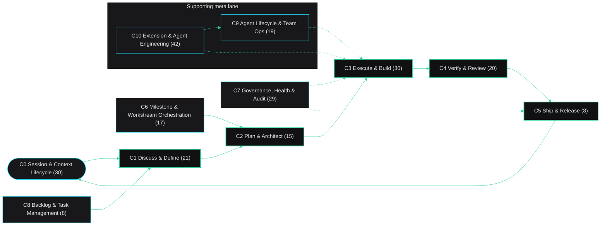

# GSD Ecosystem — Executive One-Pager

**GSD wraps software delivery in a governed 5-phase lifecycle — 241 components, 11 clusters, one map.**

| Cluster | Components |
|---|---|
| C1 — Discuss & Define | 21 |
| C2 — Plan & Architect | 15 |
| C3 — Execute & Build | 30 |
| C4 — Verify & Review | 20 |
| C5 — Ship & Release | 8 |
| C0 — Session & Context Lifecycle | 30 |
| C6 — Milestone & Workstream Orchestration | 17 |
| C7 — Governance, Health & Audit | 29 |
| C8 — Backlog & Task Management | 8 |
| C9 — Agent Lifecycle & Team Ops | 19 |
| C10 — Extension & Agent Engineering | 42 |
| C-UNMAPPED — Unmapped | 2 |

Counts equal the full map's 241-row Master matrix; 8 archived components stay in their functional clusters. Full detail: `.planning/GSD-ECOSYSTEM-MAP.md`

> [!warning] Gap 1 — Hook enforcement is workstation-bound
> Of the baseline's 17 runtime hooks, the repo registers only 2 live hooks and ships 6 sources wired solely by the installer; lesson-capture-gate.cjs sits unwired. Fix: version the hook registrations (or a settings template + installer contract test) so enforcement is reproducible from a fresh clone.

> [!note] Gap 2 — Docs disagree with the filesystem and each other
> README states 66, 64, and 30 commands and 6, 10, and 15 hooks in different sections; CLAUDE.md describes lib/*.cjs modules that are not in lib/ (it holds 2 JSON pattern files; engine logic lives in get-shit-done/bin). Fix: extend scripts/check-doc-drift.cjs to these surfaces.

> [!note] Gap 3 — Duplicate and shadowed component names
> .claude/skills/SKILL.md is byte-identical to dream-memory-consolidation/SKILL.md, and get-shit-done/commands/gsd/workstreams.md name-shadows commands/gsd/workstreams.md. Fix: delete the loose duplicate; rename or fold the engine copy.

