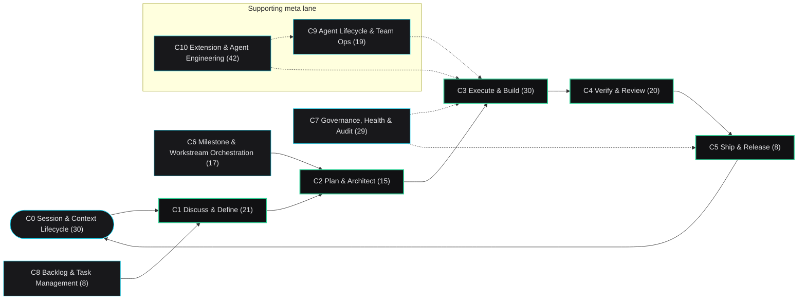

# GSD Ecosystem Map

Generated: 2026-07-12 (refresh) | Repo: `Pete-Gets-Shit-Done` @ `6364c39` (autonomy/frontier-audit) | Engine: `get-shit-done-cc v1.30.0` | Baseline: Drift History row 2026-07-12 (241)

Provenance: generated by live filesystem scan + baseline reconciliation (deterministic inventory scan; this refresh run: single-pass recount, no enrichment agents, no second-model review). Every path below was verified to exist this session; nothing is from memory.

## Executive summary

- **241 components** discovered across 7 types: 80 commands, 66 workflows, 35 agents, 47 skills, 9 hooks, 3 plugins, 1 marketplace — every one placed in exactly one of 11 lifecycle clusters (8 archived, kept in their functional clusters).
- The five spine clusters C1–C5 hold 94 components; heaviest cluster is C10 (42).
- Baseline drift this run: **zero** — all six tracked counts match the 2026-07-12 baseline row (241 total); movement was on the doc-claims surface instead (command claims 66/64/66 → 67 post-#35).
- C-UNMAPPED: 2 item(s): join-discord, get-shit-done-cc (see Coverage gaps).
- Most useful takeaway: the operational surface is command-driven (76 user-facing commands routing to 66 workflows), but runtime *enforcement* (hooks) is workstation-bound — the repo itself registers only 2 live hooks.

## Inventory by type

### Commands (80)

| Command | Namespace | Description | Status |
|---|---|---|---|
| /gsd:add-backlog | /gsd: | Add an idea to the backlog parking lot (999.x numbering) | active |
| /gsd:add-phase | /gsd: | Add phase to end of current milestone in roadmap | active |
| /gsd:add-tests | /gsd: | Generate tests for a completed phase based on UAT criteria and implementation | active |
| /gsd:add-todo | /gsd: | Capture idea or task as todo from current conversation context | active |
| /gsd:audit-agents | /gsd: | Audit the GSD agent ecosystem for frontmatter integrity, tool/permission mismatches, hygi… | active |
| /gsd:audit-deps | /gsd: | Audit package dependencies for CVEs, staleness, and license issues. Writes DEPENDENCIES-R… | active |
| /gsd:audit-milestone | /gsd: | Audit milestone completion against original intent before archiving | active |
| /gsd:audit-uat | /gsd: | Cross-phase audit of all outstanding UAT and verification items | active |
| /gsd:autonomous | /gsd: | Run all remaining phases autonomously — discuss→plan→execute per phase | active |
| /gsd:check-todos | /gsd: | List pending todos and select one to work on | active |
| /gsd:ci-watch | /gsd: | Poll GitHub Actions for the current branch, stream live status, diagnose failures, and su… | active |
| /gsd:cleanup | /gsd: | Archive accumulated phase directories from completed milestones | active |
| /gsd:closeout | /gsd: | Comprehensive project closeout — orient, audit, verify, capture, ship, finalize, polish | active |
| /gsd:complete-milestone | /gsd: | Archive completed milestone and prepare for next version | active |
| /gsd:crew | /gsd: | Agent roster, capability map, and self-assessment — show your team and find gaps | active |
| /gsd:debug | /gsd: | Systematic debugging with persistent state across context resets | active |
| /gsd:discuss-phase | /gsd: | Gather phase context through adaptive questioning before planning. Use --auto to skip int… | active |
| /gsd:do | /gsd: | Route freeform text to the right GSD command automatically | active |
| /gsd:ecosystem-map | /gsd: | Regenerate the GSD ecosystem map — live scan, baseline reconciliation, lifecycle clusteri… | active |
| /gsd:execute-phase | /gsd: | Execute all plans in a phase with wave-based parallelization | active |
| /gsd:fast | /gsd: | Execute a trivial task inline — no subagents, no planning overhead | active |
| /gsd:finalize | /gsd: | End-to-end project finalization — verify, archive, report, push, confirm clean | active |
| /gsd:forensics | /gsd: | Post-mortem investigation for failed GSD workflows — analyzes git history, artifacts, and… | active |
| /gsd:health | /gsd: | Diagnose planning directory health and optionally repair issues | active |
| /gsd:help | /gsd: | Show available GSD commands and usage guide | active |
| /gsd:insert-phase | /gsd: | Insert urgent work as decimal phase (e.g., 72.1) between existing phases | active |
| /gsd:join-discord | /gsd: | Join the GSD Discord community | active |
| /gsd:list-phase-assumptions | /gsd: | Surface Claude's assumptions about a phase approach before planning | active |
| /gsd:list-workspaces | /gsd: | List active GSD workspaces and their status | active |
| /gsd:manager | /gsd: | Interactive command center for managing multiple phases from one terminal | active |
| /gsd:map-codebase | /gsd: | Analyze codebase with parallel mapper agents to produce .planning/codebase/ documents | active |
| /gsd:milestone-summary | /gsd: | Generate a comprehensive project summary from milestone artifacts for team onboarding and… | active |
| /gsd:new-milestone | /gsd: | Start a new milestone cycle — update PROJECT.md and route to requirements | active |
| /gsd:new-project | /gsd: | Initialize a new project with deep context gathering and PROJECT.md | active |
| /gsd:new-workspace | /gsd: | Create an isolated workspace with repo copies and independent .planning/ | active |
| /gsd:next | /gsd: | Automatically advance to the next logical step in the GSD workflow | active |
| /gsd:note | /gsd: | Zero-friction idea capture. Append, list, or promote notes to todos. | active |
| /gsd:pause-work | /gsd: | Create context handoff when pausing work mid-phase | active |
| /gsd:plan-milestone-gaps | /gsd: | Create phases to close all gaps identified by milestone audit | active |
| /gsd:plan-phase | /gsd: | Create detailed phase plan (PLAN.md) with verification loop | active |
| /gsd:plant-seed | /gsd: | Capture a forward-looking idea with trigger conditions — surfaces automatically at the ri… | active |
| /gsd:portfolio | /gsd: | Cross-project dashboard — scan all projects, show status, recommend what to work on next | active |
| /gsd:pr-branch | /gsd: | Create a clean PR branch by filtering out .planning/ commits — ready for code review | active |
| /gsd:prime-patterns | /gsd: | Boot session with full context + KB pattern library injection — one command, any project | active |
| /gsd:profile-user | /gsd: | Generate developer behavioral profile and create Claude-discoverable artifacts | active |
| /gsd:progress | /gsd: | Check project progress, show context, and route to next action (execute or plan) | active |
| /gsd:quick | /gsd: | Execute a quick task with GSD guarantees (atomic commits, state tracking) but skip option… | active |
| /gsd:reapply-patches | /gsd: | Reapply local modifications after a GSD update | active |
| /gsd:remove-phase | /gsd: | Remove a future phase from roadmap and renumber subsequent phases | active |
| /gsd:remove-workspace | /gsd: | Remove a GSD workspace and clean up worktrees | active |
| /gsd:research-phase | /gsd: | Research how to implement a phase (standalone - usually use /gsd:plan-phase instead) | active |
| /gsd:resume-work | /gsd: | Resume work from previous session with full context restoration | active |
| /gsd:review-backlog | /gsd: | Review and promote backlog items to active milestone | active |
| /gsd:review | /gsd: | Request cross-AI peer review of phase plans from external AI CLIs | active |
| /gsd:session-report | /gsd: | Generate a session report with token usage estimates, work summary, and outcomes | active |
| /gsd:set-profile | /gsd: | Switch model profile for GSD agents (quality/balanced/budget/inherit) | active |
| /gsd:settings | /gsd: | Configure GSD workflow toggles and model profile | active |
| /gsd:ship | /gsd: | Create PR, run review, and prepare for merge after verification passes | active |
| /gsd:stats | /gsd: | Display project statistics — phases, plans, requirements, git metrics, and timeline | active |
| /gsd:sync-docs | /gsd: | Audit and rewrite all project documentation from live codebase state, then report what ch… | active |
| /gsd:thread | /gsd: | Manage persistent context threads for cross-session work | active |
| /gsd:ui-phase | /gsd: | Generate UI design contract (UI-SPEC.md) for frontend phases | active |
| /gsd:ui-review | /gsd: | Retroactive 6-pillar visual audit of implemented frontend code | active |
| /gsd:update | /gsd: | Update GSD to latest version with changelog display | active |
| /gsd:validate-phase | /gsd: | Retroactively audit and fill Nyquist validation gaps for a completed phase | active |
| /gsd:verify-work | /gsd: | Validate built features through conversational UAT | active |
| /gsd:workstreams | /gsd: | Manage parallel workstreams — list, create, switch, status, progress, complete, and resume | active |
| /gsd:checkpoint (engine) | /gsd: | Write a checkpoint capturing current session state to .planning/CHECKPOINT.json. Use befo… | active |
| /gsd:daily (engine) | /gsd: | Morning briefing dashboard showing milestone progress, phase status, plan completion, git… | active |
| /gsd:harden-repo (engine) | /gsd: | Audit and enforce GitHub branch protection rules for the current repo's default branch. C… | active |
| /gsd:workstreams (engine) | /gsd: | Manage parallel workstreams — list, create, switch, status, progress, complete, and resume | shadowed |
| /agent-add | / | Add a new specialist agent to your project | active |
| /agent-diagnose | / | Diagnose issues with your specialist agents — find and fix what's broken | active |
| /agent-remove | / | Remove a specialist agent from your project | active |
| /agent-reset | / | Reset a specialist agent's memory — keeps the agent, clears what it learned | active |
| /agent-setup | / | Set up specialist agents for your project — analyzes your codebase and builds an agent te… | active |
| /agent-status | / | Check the health and status of your deployed specialist agents | active |
| /agents | / | Quick overview of all your specialist agents — what they do and how they're doing | active |
| /prime | / | Boot your session — load context, check state, detect continuity from last session | active |
| /wrap | / | Close your session — log what was done, record decisions, note next steps | active |

Source: `commands/gsd/` (66) + `get-shit-done/commands/gsd/` (4, engine-internal) + `plugins/claude-mcp-ecosystem/commands/` (9)

### Workflows (66)

| Workflow | Description | Invoked by |
|---|---|---|
| add-phase | Add a new integer phase to the end of the current milestone in the roadmap. Automatically… | /add-phase |
| add-tests | Generate unit and E2E tests for a completed phase based on its SUMMARY.md, CONTEXT.md, an… | /add-tests |
| add-todo | Capture an idea, task, or issue that surfaces during a GSD session as a structured todo f… | /add-todo |
| audit-milestone | Verify milestone achieved its definition of done by aggregating phase verifications, chec… | /audit-milestone |
| audit-uat | Cross-phase audit of all UAT and verification files. Finds every outstanding item (pendin… | /audit-uat |
| autonomous | Drive all remaining milestone phases autonomously. For each incomplete phase: discuss → p… | /autonomous |
| check-todos | List all pending todos, allow selection, load full context for the selected todo, and rou… | /check-todos |
| checkpoint | Write a deterministic checkpoint to .planning/CHECKPOINT.json capturing current session s… | /checkpoint |
| ci-watch | Poll GitHub Actions CI runs for the current branch, wait for completion, surface | /ci-watch |
| cleanup | Archive accumulated phase directories from completed milestones into `.planning/milestone… | /cleanup |
| closeout | Drive an end-to-end project closeout: orient → audit → verify → capture → ship-or-freeze … | /closeout |
| complete-milestone | Mark a shipped version (v1.0, v1.1, v2.0) as complete. Creates historical record in MILES… | /complete-milestone |
| daily-startup | Chain the three existing session-boundary primitives — project boot, the read-only dashbo… | — |
| daily | Print a formatted dashboard showing milestone progress, phase status, plan completion, | /daily |
| diagnose-issues | Orchestrate parallel debug agents to investigate UAT gaps and find root causes. | — |
| discovery-phase | Execute discovery at the appropriate depth level. | — |
| discuss-phase-assumptions | Extract implementation decisions that downstream agents need — using codebase-first analy… | /discuss-phase |
| discuss-phase | Extract implementation decisions that downstream agents need. Analyze the phase to identi… | /discuss-phase |
| do | Analyze freeform text from the user and route to the most appropriate GSD command. This i… | /do |
| ecosystem-map | Regenerate the GSD ecosystem map: scan the live filesystem for every component, reconcile… | /ecosystem-map |
| execute-phase | Execute all plans in a phase using wave-based parallel execution. Orchestrator stays lean… | /execute-phase |
| execute-plan | Execute a phase prompt (PLAN.md) and create the outcome summary (SUMMARY.md). | — |
| fast | Execute a trivial task inline without subagent overhead. No PLAN.md, no Task spawning, | /fast |
| forensics | Forensics Workflow | /forensics |
| harden-repo | Audit and enforce GitHub branch protection rules via the `gh` CLI. | /harden-repo |
| health | Validate `.planning/` directory integrity and report actionable issues. Checks for missin… | /health |
| help | Display the complete GSD command reference. Output ONLY the reference content. Do NOT add… | /help |
| idea-to-shipped | Turn a freeform idea into shipped code: discuss → plan → execute → verify → ship, unatten… | — |
| insert-phase | Insert a decimal phase for urgent work discovered mid-milestone between existing integer … | /insert-phase |
| list-phase-assumptions | Surface Claude's assumptions about a phase before planning, enabling users to correct mis… | /list-phase-assumptions |
| list-workspaces | List all GSD workspaces found in ~/gsd-workspaces/ with their status. | /list-workspaces |
| manager | Interactive command center for managing a milestone from a single terminal. Shows a dashb… | /manager |
| map-codebase | Orchestrate parallel codebase mapper agents to analyze codebase and produce structured do… | /map-codebase |
| milestone-summary | Milestone Summary Workflow | /milestone-summary |
| new-milestone | Start a new milestone cycle for an existing project. Loads project context, gathers miles… | /new-milestone |
| new-project | Initialize a new project through unified flow: questioning, research (optional), requirem… | /new-project |
| new-workspace | Create an isolated workspace directory with git repo copies (worktrees or clones) and an … | /new-workspace |
| next | Detect current project state and automatically advance to the next logical GSD workflow s… | /next |
| node-repair | Autonomous repair operator for failed task verification. Invoked by execute-plan when a t… | — |
| note | Zero-friction idea capture. One Write call, one confirmation line. No questions, no promp… | /note |
| pause-work | Create structured `.planning/HANDOFF.json` and `.continue-here.md` handoff files to prese… | /pause-work |
| plan-milestone-gaps | Create all phases necessary to close gaps identified by `/gsd:audit-milestone`. Reads MIL… | /plan-milestone-gaps |
| plan-phase | Create executable phase prompts (PLAN.md files) for a roadmap phase with integrated resea… | /plan-phase |
| plant-seed | Capture a forward-looking idea as a structured seed file with trigger conditions. | /plant-seed |
| pr-branch | Create a clean branch for pull requests by filtering out .planning/ commits. | /pr-branch |
| profile-user | Orchestrate the full developer profiling flow: consent, session analysis (or questionnair… | /profile-user |
| progress | Check project progress, summarize recent work and what's ahead, then intelligently route … | /progress |
| quick | Execute small, ad-hoc tasks with GSD guarantees (atomic commits, STATE.md tracking). Quic… | /quick |
| remove-phase | Remove an unstarted future phase from the project roadmap, delete its directory, renumber… | /remove-phase |
| remove-workspace | Remove a GSD workspace, cleaning up git worktrees and deleting the workspace directory. | /remove-workspace |
| research-phase | Research how to implement a phase. Spawns gsd-research-orchestrator (scope: phase) with p… | — |
| resume-project | Instantly restore full project context so "Where were we?" has an immediate, complete ans… | /resume-work |
| review | Cross-AI peer review — invoke external AI CLIs to independently review phase plans. | /review |
| session-report | Generate a post-session summary document capturing work performed, outcomes achieved, and… | /session-report |
| settings | Interactive configuration of GSD workflow agents (research, plan_check, verifier) and mod… | /settings |
| ship | Create a pull request from completed phase/milestone work, generate a rich PR body from p… | /ship |
| smart-discuss | Autonomous-optimized variant of the `gsd:discuss-phase` skill. Proposes grey area answers… | — |
| stats | Display comprehensive project statistics including phases, plans, requirements, git metri… | /stats |
| transition | Mark current phase complete and advance to next. This is the natural point where progress… | — |
| ui-phase | Generate a UI design contract (UI-SPEC.md) for frontend phases. Orchestrates gsd-ui-resea… | /ui-phase |
| ui-review | Retroactive 6-pillar visual audit of implemented frontend code. Standalone command that w… | /ui-review |
| update | Check for GSD updates via npm, display changelog for versions between installed and lates… | /update |
| validate-phase | Audit Nyquist validation gaps for a completed phase. Generate missing tests. Update VALID… | /validate-phase |
| verify-phase | Verify phase goal achievement through goal-backward analysis. Check that the codebase del… | — |
| verify-work | Validate built features through conversational testing with persistent state. Creates UAT… | /verify-work |
| wrap-and-sync | Wrap a session before stopping: re-measure coverage, close doc drift in the same commit u… | — |

Source: `get-shit-done/workflows/`

### Built-in agents (17)

| Agent | Model | Description | Spawned by |
|---|---|---|---|
| gsd-advisor-researcher | sonnet | Researches a single gray area decision and returns a structured comparison tabl… | discuss-phase |
| gsd-assumptions-analyzer | haiku | Deeply analyzes codebase for a phase and returns structured assumptions with ev… | discuss-phase-assumptions |
| gsd-codebase-mapper | sonnet | Explores codebase and writes structured analysis documents. Spawned by map-code… | map-codebase, map-codebase |
| gsd-debugger | opus | Investigates bugs using scientific method, manages debug sessions, handles chec… | debug, diagnose-issues |
| gsd-dependency-auditor | haiku | Audits package dependencies for security vulnerabilities, outdated versions, an… | audit-deps |
| gsd-ecosystem-auditor | haiku | Audits the GSD agent ecosystem for frontmatter integrity, tool/permission misma… | audit-agents |
| gsd-executor | sonnet | Executes GSD plans with atomic commits, deviation handling, checkpoint protocol… | quick, execute-phase +3 |
| gsd-planner | opus | Creates executable phase plans with task breakdown, dependency analysis, and go… | plan-phase, quick +4 |
| gsd-research-orchestrator | sonnet | Unified research agent for both phase-level and project-level research. Accepts… | research-phase, new-milestone +4 |
| gsd-research-synthesizer | sonnet | Synthesizes research outputs from parallel researcher agents into SUMMARY.md. S… | new-milestone, new-project |
| gsd-roadmapper | sonnet | Creates project roadmaps with phase breakdown, requirement mapping, success cri… | new-milestone, new-project |
| gsd-ui-auditor | sonnet | Retroactive 6-pillar visual audit of implemented frontend code. Produces scored… | ui-review |
| gsd-ui-checker | haiku | Validates UI-SPEC.md design contracts against 6 quality dimensions. Produces BL… | ui-phase, ui-phase |
| gsd-ui-researcher | sonnet | Produces UI-SPEC.md design contract for frontend phases. Reads upstream artifac… | ui-phase, ui-phase |
| gsd-user-profiler | haiku | Analyzes extracted session messages across 8 behavioral dimensions to produce a… | profile-user |
| gsd-validator-hub | haiku | Unified validation agent for both Claude Code extensions and agent ecosystems. … | ship |
| gsd-verifier | opus | Unified verification agent with scope-based routing. Scopes — general (post-exe… | plan-phase, audit-milestone +6 |

Source: `agents/`

### Archived agents (8)

| Agent | Model | Description | Spawned by |
|---|---|---|---|
| extension-validator | haiku | Read-only quality gate that validates Claude Code extensions against official d… | SKILL, SKILL |
| gsd-integration-checker | — | Verifies cross-phase integration and E2E flows. Checks that phases connect prop… | — |
| gsd-nyquist-auditor | — | Fills Nyquist validation gaps by generating tests and verifying coverage for ph… | — |
| gsd-phase-researcher | — | Researches how to implement a phase before planning. Produces RESEARCH.md consu… | — |
| gsd-plan-checker | — | Verifies plans will achieve phase goal before execution. Goal-backward analysis… | — |
| gsd-project-researcher | — | Researches domain ecosystem before roadmap creation. Produces files in .plannin… | — |
| gsd-security-guardian | sonnet | Design-time security reviewer for GSD agents, hooks, and skills. Reviews agent … | — |
| validator | haiku | Tests agent files for structural correctness, validates frontmatter against the… | — |

Source: `agents/_archived/`

### Project-scoped agents (3)

| Agent | Model | Description | Spawned by |
|---|---|---|---|
| docs-sync | sonnet | Keeps documentation current after code changes. Updates README.md, CLAUDE.md, C… | — |
| plugin-developer | sonnet | Builds and modifies GSD commands, skills, agents, hooks, and installer logic in… | — |
| test-runner | sonnet | Runs the 2,600+ test assertions across 529 suites in get-shit-done/, diagnoses … | — |

Source: `.claude/agents/`

### Plugin agents (7)

| Agent | Model | Description | Spawned by |
|---|---|---|---|
| extension-builder | inherit | Builds Claude Code extensions (skills, hooks, agents, plugins) from specificati… | — |
| architect | inherit | Designs subagent architecture specifications from project analysis. Produces vi… | agent-setup |
| auditor | haiku | Analyzes subagent ecosystem health for the companion skill. Detects memory bloa… | agent-diagnose, SKILL +1 |
| memory-seeder | sonnet | Populates agent memory files with baseline knowledge extracted from project sou… | agent-add, agent-setup +2 |
| repo-doc-architect | haiku | Use this agent when you need to create or update comprehensive repository docum… | finalize |
| scaffolder | sonnet | Creates agent files, routing rules, memory directories, and project configurati… | agent-add, agent-setup +2 |
| validator | haiku | Tests agent files for structural correctness, validates frontmatter against the… | agent-add, agent-setup +2 |

Source: `plugins/claude-mcp-ecosystem/subagent-lifecycle/agents/ + plugins/claude-code-factory/agents/`

### Plugin skills (47)

| Skill | Plugin | Layer | Description | Status |
|---|---|---|---|---|
| agent-factory | claude-code-factory | generator | Generates Claude Code agent .md files for application development spe… | active |
| cc-factory | claude-code-factory | generator | Direct-access generator for Claude Code extensions — skills, hooks, s… | active |
| cc-ref-agent-archetypes | claude-code-factory | reference | 72 application development agent archetypes across 10 domains — syste… | active |
| cc-ref-agent-workflows | claude-code-factory | reference | Workflow patterns and reusable system prompt building blocks for appl… | active |
| cc-ref-cicd | claude-code-factory | reference | Claude Code CI/CD reference — GitHub Actions (claude-code-action@v1 i… | active |
| cc-ref-hooks | claude-code-factory | reference | Claude Code hooks reference — lifecycle events, PreToolUse, PostToolU… | active |
| cc-ref-mcp | claude-code-factory | reference | Claude Code MCP reference — transport types (HTTP, SSE, stdio), insta… | active |
| cc-ref-multi-agent | claude-code-factory | reference | Multi-agent system design reference — orchestration patterns (prompt … | active |
| cc-ref-output-styles | claude-code-factory | reference | Claude Code output styles reference — frontmatter fields (name, descr… | active |
| cc-ref-permissions | claude-code-factory | reference | Claude Code permissions reference — permission rule syntax, allow/ask… | active |
| cc-ref-plugins | claude-code-factory | reference | Claude Code plugins reference — plugin.json manifest schema, plugin d… | active |
| cc-ref-settings | claude-code-factory | reference | Claude Code settings.json reference — configuration scopes, managed s… | active |
| cc-ref-skills | claude-code-factory | reference | Claude Code skills reference — SKILL.md structure, frontmatter fields… | active |
| cc-ref-subagents | claude-code-factory | reference | Claude Code subagents reference — agent frontmatter fields, built-in … | active |
| cicd-generator | claude-code-factory | generator | Generates CI/CD pipeline configurations for Claude Code — GitHub Acti… | active |
| dev-recipes | claude-code-factory | generator | Browse and execute 86 pre-built recipes for application development a… | active |
| dev-team-concierge | claude-code-factory | generator | Orchestrates application development agent generation across all doma… | active |
| dev-team-guide | claude-code-factory | routing-diagnostic | Invisible router for application development agent generation. Detect… | active |
| doc-sync | claude-code-factory | routing-diagnostic | Checks cc-ref-* reference skills against live Anthropic documentation… | active |
| extension-auditor | claude-code-factory | routing-diagnostic | Scans ~/.claude/skills/ and ~/.claude/agents/ for structural issues, … | active |
| extension-combo-engine | claude-code-factory | routing-diagnostic | Detects when a request requires multiple coordinated Claude Code exte… | active |
| extension-concierge | claude-code-factory | routing-diagnostic | Orchestrator that turns natural language requests into Claude Code ex… | active |
| extension-fixer | claude-code-factory | routing-diagnostic | Diagnoses and repairs broken Claude Code extensions. When a skill doe… | active |
| extension-guide | claude-code-factory | routing-diagnostic | Reference guide for building Claude Code extensions. Covers skill str… | active |
| extension-installer | claude-code-factory | routing-diagnostic | Installs generated Claude Code extensions in the correct location bas… | active |
| hook-factory | claude-code-factory | generator | Generates complete Claude Code hook configurations from natural langu… | active |
| intent-engine | claude-code-factory | routing-diagnostic | Behavioral classification engine for Claude Code extension generation… | active |
| mcp-configurator | claude-code-factory | generator | Generates correct MCP server configurations for Claude Code — CLI com… | active |
| output-style-creator | claude-code-factory | generator | Creates custom Claude Code output style files with correct frontmatte… | active |
| plugin-packager | claude-code-factory | generator | Packages Claude Code components into distributable plugins with corre… | active |
| scenario-library | claude-code-factory | reference | Browseable cookbook of 40 pre-built Claude Code extension recipes. Ea… | active |
| settings-architect | claude-code-factory | generator | Generates complete Claude Code settings.json configurations from natu… | active |
| setup-explainer | claude-code-factory | routing-diagnostic | Scans all installed Claude Code extensions and produces a plain-Engli… | active |
| skill-factory | claude-code-factory | generator | Generates complete Claude Code SKILL.md files from natural language d… | active |
| smart-scaffold | claude-code-factory | routing-diagnostic | Merged conversational scaffolding and progressive disclosure engine. … | active |
| team-combo-engine | claude-code-factory | generator | Assembles coordinated teams of application development agents from 14… | active |
| team-configurator | claude-code-factory | generator | Detects the technology stack of the current project across all domain… | active |
| upgrade-scanner | claude-code-factory | generator | Cross-references existing Claude Code configurations against latest d… | active |
| agent-design-patterns | claude-mcp-ecosystem | — | Seven proven archetypes for subagent design (Explorer, Builder, Surge… | active |
| frontmatter-reference | claude-mcp-ecosystem | — | Complete YAML frontmatter schema for Claude Code subagent .md files. … | active |
| mcp-catalog | claude-mcp-ecosystem | — | Catalog of available MCP servers mapped to user-described capabilitie… | active |
| project-guide | claude-mcp-ecosystem | — | Invisible router for project organization and specialist management i… | active |
| subagent-companion | claude-mcp-ecosystem | — | Day-to-day management interface for deployed Claude Code subagent eco… | active |
| subagent-concierge | claude-mcp-ecosystem | — | Non-technical entry point for Claude Code subagent setup. Detects whe… | active |
| workspace-lifecycle-ref | claude-mcp-ecosystem | — | Workspace command lifecycle reference — /prime, /wrap session bookend… | active |
| dream-memory-consolidation | repo-local (.claude/) | — | 4-phase memory consolidation modeled on Claude Code's /dream feature.… | active |
| SKILL.md (loose) | repo-local (.claude/) | — | 4-phase memory consolidation modeled on Claude Code's /dream feature.… | duplicate |

Source: `plugins/claude-code-factory/skills/` (38) + `plugins/claude-mcp-ecosystem/skills/` (7) + `.claude/skills/` (2)

### Hooks (9)

| Hook | Event | What it does | Status | Registered in |
|---|---|---|---|---|
| gsd-check-update | SessionStart | Check for GSD updates in background, write result to cache Called by SessionSta… | active | — |
| gsd-config-protection | PreToolUse | GSD Config Protection — PreToolUse hook Blocks Write/Edit operations targeting … | active | — |
| gsd-context-monitor | PostToolUse | Context Monitor - PostToolUse/AfterTool hook (Gemini uses AfterTool) Reads cont… | active | — |
| gsd-cost-tracker | PostToolUse | GSD Cost Tracker — PostToolUse hook Appends lightweight session usage metrics t… | active | — |
| gsd-prompt-guard | PreToolUse | GSD Prompt Injection Guard — PreToolUse hook Scans file content being written t… | active | — |
| gsd-statusline | UNKNOWN — not stated in source | Claude Code Statusline - GSD Edition Shows: model \| current task \| directory … | active | — |
| lesson-capture-gate | Stop | Stop hook: scans transcript for correction signals; blocks session close if tas… | unwired | — |
| gsd-agent-health-check | SubagentStop | SubagentStop hook: checks agent .md frontmatter integrity and flags repo-vs-ins… | active | `.claude/settings.json` |
| mcp-health-check | SessionStart | SessionStart hook: runs `claude mcp list` and injects an additionalContext warn… | active | `plugins/claude-mcp-ecosystem/workspace-ops/hooks/hooks.json` |

Source: `hooks/` (6 sources; installer-wired) + `.claude/hooks/` (1) + live registrations in `.claude/settings.json` and `plugins/claude-mcp-ecosystem/workspace-ops/hooks.json`

### Plugins & marketplace (4)

| Name | Type | Version | Purpose |
|---|---|---|---|
| claude-code-factory | plugin | 1.0.0 | Extension generation — skills, hooks, agents, plugins, MCP configs, CI/CD pipelines, dev … |
| claude-mcp-ecosystem | plugin | 2.0.0 | Project agent ecosystem — set up, manage, and diagnose specialist agents, plus session co… |
| get-shit-done-cc | plugin | 1.30.0 | A meta-prompting, context engineering and spec-driven development system for Claude Code,… |
| local-plugin-marketplace | marketplace | — | Registers 2 plugin(s) |

Source: `plugins/*/.claude-plugin/plugin.json` + `package.json` + `plugins/claude-mcp-ecosystem/.claude-plugin/marketplace.json`

### MCP servers (0 in repo scope)

| Result | Evidence |
|---|---|
| NOT FOUND | no `.mcp.json` anywhere in the repo; no `mcpServers` key in `.claude/settings.json` |

Source: `**/.mcp.json` scan + `.claude/settings.json`. MCP-related *components* (mcp-catalog skill, mcp-configurator generator, cc-ref-mcp reference, mcp-health-check hook) are inventoried above under skills/hooks. Session-level MCP servers are environment configuration, not repo components.

## Drift Report

Live system vs the previous run's Drift History row (2026-07-12: 241 total — 80 commands, 66 workflows, 35 agents, 47 skills, 9 hooks). The live system wins; every baseline column appears below. Workstation-scoped surfaces (installed hooks/plugins under `~/.claude`) remain out of scope in this container, as in the prior run.

| Component type | Baseline | Discovered | Δ | Reason |
|---|---|---|---|---|
| Total components | 241 | 241 | 0 | Match — no components added, removed, or renamed since the 2026-07-12 refresh (`ea755e9`, PR #40). |
| Commands | 80 | 80 | 0 | Match: 67 core `commands/gsd/` + 4 engine-internal `get-shit-done/commands/gsd/` (workstreams still shadowed) + 9 ecosystem `plugins/claude-mcp-ecosystem/commands/`. |
| Workflows | 66 | 66 | 0 | Match: `get-shit-done/workflows/`. |
| Agents | 35 | 35 | 0 | Match: 17 built-in + 8 archived + 3 project-scoped + 7 plugin. |
| Skills | 47 | 47 | 0 | Match: 38 Factory + 7 MCP-Ecosystem + 2 repo-local `.claude/skills/` (loose SKILL.md still byte-identical to dream-memory-consolidation/SKILL.md). |
| Hooks | 9 | 9 | 0 | Match: 6 sources `hooks/*.js` + 1 unwired local `.claude/hooks/lesson-capture-gate.cjs` + 2 live registrations (SubagentStop in `.claude/settings.json`; SessionStart in `plugins/claude-mcp-ecosystem/workspace-ops/hooks/hooks.json`). |
| Plugins + marketplace (inside Total) | 3 + 1 | 3 + 1 | 0 | Match (get-shit-done-cc 1.30.0, claude-code-factory 1.0.0, claude-mcp-ecosystem 2.0.0; local-plugin-marketplace registers 2). Citation fix this run: marketplace.json lives at `plugins/claude-mcp-ecosystem/.claude-plugin/marketplace.json` — the previously cited `plugins/.claude-plugin/marketplace.json` never existed in git history. |
| MCP servers | — | 0 | — | NOT FOUND in repo scope — no .mcp.json anywhere, no mcpServers key in .claude/settings.json. Session-level MCP servers are environment config, not repo components. |

### Documentation claims vs live counts (three-way drift)

The repo's own docs disagree internally; measured values above are the arbiter.

| Doc | Line | Claim | Metric | Claimed | Live |
|---|---|---|---|---|---|
| `CLAUDE.md` | 14 | **67 slash commands** spanning discuss, plan, execute, verify, ship, milestone … | commands | 67 | 76 |
| `CLAUDE.md` | 15 | **17 built-in agents** (gsd-verifier, gsd-planner, gsd-executor, gsd-debugger, … | agents | 17 | 17 |
| `CLAUDE.md` | 16 | **45 Claude Code skills** covering command implementations, utilities, and gove… | skills | 45 | 45 |
| `CLAUDE.md` | 18 | **5-phase delivery lifecycle**: discuss → plan → execute → verify → ship, with … | workflows | 5 | 66 |
| `CLAUDE.md` | 42 | Three new execution hooks provide runtime security: prompt injection detection,… | hooks | 3 | 6 |
| `CLAUDE.md` | 42 | prompt injection detection (18 patterns in v2.3, expanded to 23 in v2.4) | other | 23 | — (not measured this run) |
| `CLAUDE.md` | 42 | config file protection (32 files) | other | 32 | — (not measured this run) |
| `CLAUDE.md` | 51 | **Scale**: 573 test suites, 2,932 assertions, 91.82% line coverage | tests | 573 | — (not measured this run) |
| `CLAUDE.md` | 51 | **Scale**: 573 test suites, 2,932 assertions, 91.82% line coverage | tests | 2932 | — (not measured this run) |
| `CLAUDE.md` | 51 | **Scale**: 573 test suites, 2,932 assertions, 91.82% line coverage | coverage | 91.82 | — (not measured this run) |
| `CLAUDE.md` | 52 | **Coverage thresholds**: 90% overall / 80% per module / 95% security-critical m… | coverage | 90 | — (not measured this run) |
| `CLAUDE.md` | 52 | **Coverage thresholds**: 90% overall / 80% per module / 95% security-critical m… | coverage | 80 | — (not measured this run) |
| `CLAUDE.md` | 52 | **Coverage thresholds**: 90% overall / 80% per module / 95% security-critical m… | coverage | 95 | — (not measured this run) |
| `CLAUDE.md` | 66 | Branch protection on `main` now requires **5 passing status checks** before mer… | other | 5 | — (not measured this run) |
| `CLAUDE.md` | 30 | lib/ Core runtime — core.cjs, security.cjs, governance.cjs, classify.cjs, model… | other | — | — (not measured this run) |
| `README.md` | 59 | 67 commands, 17 agents, 6 hooks, wave-based parallel execution | commands | 67 | 76 |
| `README.md` | 59 | 67 commands, 17 agents, 6 hooks, wave-based parallel execution | agents | 17 | 17 |
| `README.md` | 59 | 67 commands, 17 agents, 6 hooks, wave-based parallel execution | hooks | 6 | 6 |
| `README.md` | 60 | 10 hooks, permission rules, 2 plugin engines (45 skills, 10 subagents), 7 refer… | hooks | 10 | 6 |
| `README.md` | 60 | 10 hooks, permission rules, 2 plugin engines (45 skills, 10 subagents), 7 refer… | skills | 45 | 45 |
| `README.md` | 60 | 10 hooks, permission rules, 2 plugin engines (45 skills, 10 subagents), 7 refer… | agents | 10 | 17 |
| `README.md` | 60 | 10 hooks, permission rules, 2 plugin engines (45 skills, 10 subagents), 7 refer… | other | 7 | — (not measured this run) |
| `README.md` | 225 | Before we get into the 67 commands that make this thing work, the syntax varies… | commands | 67 | 76 |
| `README.md` | 1110 | **Safety hooks** — 15 hooks fire automatically during Claude Code's lifecycle e… | hooks | 15 | 6 |
| `README.md` | 1186 | **Session commands table** — 30 commands across GSD, MCP ecosystem, and utiliti… | commands | 30 | 76 |
| `README.md` | 1189 | coverage thresholds (90% overall, 80% per module, 95% security-critical) | coverage | 90 | — (not measured this run) |
| `README.md` | 1351 | ## Code Factory Skills (38) | skills | 38 | 45 |
| `README.md` | 1355 | ### Reference Library (13 skills) | skills | 13 | 45 |
| `README.md` | 1373 | ### Generator Skills (14 skills) | skills | 14 | 45 |
| `README.md` | 1392 | ### Routing and Diagnostic Skills (11 skills) | skills | 11 | 45 |
| `docs/DEVOPS-HANDOFF.md` | 46 | Commands \| `~/.claude/get-shit-done/commands/` \| 67 GSD slash commands | commands | 67 | 76 |
| `docs/DEVOPS-HANDOFF.md` | 47 | Agents \| `~/.claude/get-shit-done/agents/` \| 17 specialized agent definitions | agents | 17 | 17 |
| `docs/DEVOPS-HANDOFF.md` | 48 | Hooks \| `~/.claude/get-shit-done/hooks/` \| 6 execution hooks (bundled JS) | hooks | 6 | 6 |
| `docs/DEVOPS-HANDOFF.md` | 50 | Governance \| `~/.claude/get-shit-done/governance/` \| CLAUDE.md template, 10 g… | hooks | 10 | 6 |
| `docs/DEVOPS-HANDOFF.md` | 51 | Plugins \| Respective plugin directories \| 45 skills, 10 subagents, 6 referenc… | skills | 45 | 45 |
| `docs/DEVOPS-HANDOFF.md` | 51 | Plugins \| Respective plugin directories \| 45 skills, 10 subagents, 6 referenc… | agents | 10 | 17 |
| `docs/DEVOPS-HANDOFF.md` | 51 | Plugins \| Respective plugin directories \| 45 skills, 10 subagents, 6 referenc… | other | 6 | — (not measured this run) |
| `docs/DEVOPS-HANDOFF.md` | 74 | `npm run test:e2e:smoke` \| Run E2E smoke subset (12 tests) | tests | 12 | — (not measured this run) |
| `docs/DEVOPS-HANDOFF.md` | 131 | `core.cjs` \| 95.60% \| 90.84% | coverage | 95.6 | — (not measured this run) |
| `docs/DEVOPS-HANDOFF.md` | 135 | `security.cjs` \| 100.00% \| 100.00% | coverage | 100 | — (not measured this run) |
| `docs/DEVOPS-HANDOFF.md` | 139 | Overall project: >= 90% | coverage | 90 | — (not measured this run) |
| `docs/DEVOPS-HANDOFF.md` | 140 | Individual modules: >= 80% | coverage | 80 | — (not measured this run) |
| `docs/DEVOPS-HANDOFF.md` | 141 | Security-critical modules: >= 95% | coverage | 95 | — (not measured this run) |
| `docs/DEVOPS-HANDOFF.md` | 314 | Test coverage \| 95%+ line, 90%+ branch on core | coverage | 95 | — (not measured this run) |
| `docs/DEVOPS-HANDOFF.md` | 315 | Security coverage \| 100% on security module | coverage | 100 | — (not measured this run) |
| `docs/DEVOPS-HANDOFF.md` | 336 | 4D scoring rubric \| security (35%), performance (25%), correctness (25%), main… | other | 35 | — (not measured this run) |

Live basis: 76 user-facing commands (67 `/gsd:` + 9 eco), 66 workflows, 17 built-in agents, 45 plugin skills, 6 hook sources. Precedent: `scripts/check-doc-drift.cjs` already reconciles a subset of these in CI.

## Lifecycle Cluster Map

One primary cluster per component (secondary stages are notes, not second assignments). Assignment authority: the canonical C0–C10 definitions + tie-breakers (Appendix A).

## C0 — Session & Context Lifecycle

Bookends every session: boot, checkpoint, resume, close-out.

| Component | Type | Primary role in this stage | Secondary stages |
|---|---|---|---|
| /gsd:checkpoint (engine) | command | Write a checkpoint capturing current session state to .planning/CHECKPOINT.json. Use… | — |
| /gsd:daily (engine) | command | Morning briefing dashboard showing milestone progress, phase status, plan completion… | — |
| /gsd:help | command | Show available GSD commands and usage guide | — |
| /gsd:note | command | Zero-friction idea capture. Append, list, or promote notes to todos. | — |
| /gsd:pause-work | command | Create context handoff when pausing work mid-phase | — |
| /prime | command | Boot your session — load context, check state, detect continuity from last session | — |
| /gsd:prime-patterns | command | Boot session with full context + KB pattern library injection — one command, any pro… | — |
| /gsd:resume-work | command | Resume work from previous session with full context restoration | — |
| /gsd:session-report | command | Generate a session report with token usage estimates, work summary, and outcomes | — |
| /gsd:settings | command | Configure GSD workflow toggles and model profile | — |
| /gsd:stats | command | Display project statistics — phases, plans, requirements, git metrics, and timeline | — |
| /wrap | command | Close your session — log what was done, record decisions, note next steps | — |
| gsd-check-update | hook | Check for GSD updates in background, write result to cache Called by SessionStart ho… | — |
| gsd-statusline | hook | Claude Code Statusline - GSD Edition Shows: model \| current task \| directory \| co… | C7 (produces the bridge metrics gsd-context-monitor consumes — R1) |
| mcp-health-check | hook | SessionStart hook: runs `claude mcp list` and injects an additionalContext warning a… | C9 (MCP fleet health) |
| dream-memory-consolidation | skill | 4-phase memory consolidation modeled on Claude Code's /dream feature. Orients on exi… | — |
| project-guide | skill | Invisible router for project organization and specialist management in Claude Code. … | — |
| SKILL.md (loose) *(duplicate)* | skill | 4-phase memory consolidation modeled on Claude Code's /dream feature. Orients on exi… | — |
| workspace-lifecycle-ref | skill | Workspace command lifecycle reference — /prime, /wrap session bookends, GSD executio… | — |
| checkpoint | workflow | Write a deterministic checkpoint to .planning/CHECKPOINT.json capturing current sess… | — |
| daily | workflow | Print a formatted dashboard showing milestone progress, phase status, plan completio… | — |
| daily-startup | workflow | Chain the three existing session-boundary primitives — project boot, the read-only d… | — |
| help | workflow | Display the complete GSD command reference. Output ONLY the reference content. Do NO… | — |
| note | workflow | Zero-friction idea capture. One Write call, one confirmation line. No questions, no … | — |
| pause-work | workflow | Create structured `.planning/HANDOFF.json` and `.continue-here.md` handoff files to … | — |
| resume-project | workflow | Instantly restore full project context so "Where were we?" has an immediate, complet… | — |
| session-report | workflow | Generate a post-session summary document capturing work performed, outcomes achieved… | — |
| settings | workflow | Interactive configuration of GSD workflow agents (research, plan_check, verifier) an… | — |
| stats | workflow | Display comprehensive project statistics including phases, plans, requirements, git … | — |
| wrap-and-sync | workflow | Wrap a session before stopping: re-measure coverage, close doc drift in the same com… | — |

**30 components** — 12 commands, 3 hooks, 4 skills, 11 workflows

## C1 — Discuss & Define

Lifecycle phase 1: requirements, research, assumptions, UX definition.

| Component | Type | Primary role in this stage | Secondary stages |
|---|---|---|---|
| gsd-advisor-researcher | agent | Researches a single gray area decision and returns a structured comparison table wit… | — |
| gsd-assumptions-analyzer | agent | Deeply analyzes codebase for a phase and returns structured assumptions with evidenc… | — |
| gsd-phase-researcher *(archived)* | agent | Researches how to implement a phase before planning. Produces RESEARCH.md consumed b… | — |
| gsd-project-researcher *(archived)* | agent | Researches domain ecosystem before roadmap creation. Produces files in .planning/res… | — |
| gsd-research-orchestrator | agent | Unified research agent for both phase-level and project-level research. Accepts scop… | — |
| gsd-research-synthesizer | agent | Synthesizes research outputs from parallel researcher agents into SUMMARY.md. Spawne… | — |
| gsd-ui-researcher | agent | Produces UI-SPEC.md design contract for frontend phases. Reads upstream artifacts, d… | — |
| gsd-user-profiler | agent | Analyzes extracted session messages across 8 behavioral dimensions to produce a scor… | — |
| /gsd:discuss-phase | command | Gather phase context through adaptive questioning before planning. Use --auto to ski… | — |
| /gsd:list-phase-assumptions | command | Surface Claude's assumptions about a phase approach before planning | — |
| /gsd:profile-user | command | Generate developer behavioral profile and create Claude-discoverable artifacts | — |
| /gsd:research-phase | command | Research how to implement a phase (standalone - usually use /gsd:plan-phase instead) | — |
| /gsd:ui-phase | command | Generate UI design contract (UI-SPEC.md) for frontend phases | — |
| discovery-phase | workflow | Execute discovery at the appropriate depth level. | — |
| discuss-phase | workflow | Extract implementation decisions that downstream agents need. Analyze the phase to i… | — |
| discuss-phase-assumptions | workflow | Extract implementation decisions that downstream agents need — using codebase-first … | — |
| list-phase-assumptions | workflow | Surface Claude's assumptions about a phase before planning, enabling users to correc… | — |
| profile-user | workflow | Orchestrate the full developer profiling flow: consent, session analysis (or questio… | — |
| research-phase | workflow | Research how to implement a phase. Spawns gsd-research-orchestrator (scope: phase) w… | — |
| smart-discuss | workflow | Autonomous-optimized variant of the `gsd:discuss-phase` skill. Proposes grey area an… | — |
| ui-phase | workflow | Generate a UI design contract (UI-SPEC.md) for frontend phases. Orchestrates gsd-ui-… | — |

**21 components** — 8 agents, 5 commands, 8 workflows (of which 2 archived)

## C2 — Plan & Architect

Lifecycle phase 2: intent into committed plan and phase structure.

| Component | Type | Primary role in this stage | Secondary stages |
|---|---|---|---|
| gsd-planner | agent | Creates executable phase plans with task breakdown, dependency analysis, and goal-ba… | — |
| gsd-roadmapper | agent | Creates project roadmaps with phase breakdown, requirement mapping, success criteria… | — |
| /gsd:add-phase | command | Add phase to end of current milestone in roadmap | — |
| /gsd:insert-phase | command | Insert urgent work as decimal phase (e.g., 72.1) between existing phases | — |
| /gsd:plan-milestone-gaps | command | Create phases to close all gaps identified by milestone audit | — |
| /gsd:plan-phase | command | Create detailed phase plan (PLAN.md) with verification loop | — |
| /gsd:remove-phase | command | Remove a future phase from roadmap and renumber subsequent phases | — |
| /gsd:set-profile | command | Switch model profile for GSD agents (quality/balanced/budget/inherit) | — |
| /gsd:validate-phase | command | Retroactively audit and fill Nyquist validation gaps for a completed phase | C4 (audits a completed phase, generates tests — R1) |
| add-phase | workflow | Add a new integer phase to the end of the current milestone in the roadmap. Automati… | — |
| insert-phase | workflow | Insert a decimal phase for urgent work discovered mid-milestone between existing int… | — |
| plan-milestone-gaps | workflow | Create all phases necessary to close gaps identified by `/gsd:audit-milestone`. Read… | — |
| plan-phase | workflow | Create executable phase prompts (PLAN.md files) for a roadmap phase with integrated … | — |
| remove-phase | workflow | Remove an unstarted future phase from the project roadmap, delete its directory, ren… | — |
| validate-phase | workflow | Audit Nyquist validation gaps for a completed phase. Generate missing tests. Update … | — |

**15 components** — 2 agents, 7 commands, 6 workflows

## C3 — Execute & Build

Lifecycle phase 3: doing the work, with write-time guards.

| Component | Type | Primary role in this stage | Secondary stages |
|---|---|---|---|
| gsd-debugger | agent | Investigates bugs using scientific method, manages debug sessions, handles checkpoin… | — |
| gsd-executor | agent | Executes GSD plans with atomic commits, deviation handling, checkpoint protocols, an… | — |
| gsd-ui-checker | agent | Validates UI-SPEC.md design contracts against 6 quality dimensions. Produces BLOCK/F… | — |
| /gsd:autonomous | command | Run all remaining phases autonomously — discuss→plan→execute per phase | — |
| /gsd:crew | command | Agent roster, capability map, and self-assessment — show your team and find gaps | C9 (agent roster display + team self-assessment — R1) |
| /gsd:debug | command | Systematic debugging with persistent state across context resets | — |
| /gsd:do | command | Route freeform text to the right GSD command automatically | — |
| /gsd:execute-phase | command | Execute all plans in a phase with wave-based parallelization | — |
| /gsd:fast | command | Execute a trivial task inline — no subagents, no planning overhead | — |
| /gsd:manager | command | Interactive command center for managing multiple phases from one terminal | — |
| /gsd:next | command | Automatically advance to the next logical step in the GSD workflow | — |
| /gsd:progress | command | Check project progress, show context, and route to next action (execute or plan) | — |
| /gsd:quick | command | Execute a quick task with GSD guarantees (atomic commits, state tracking) but skip o… | — |
| /gsd:reapply-patches | command | Reapply local modifications after a GSD update | — |
| /gsd:thread | command | Manage persistent context threads for cross-session work | C0 (cross-session context threads — R1) |
| gsd-config-protection | hook | GSD Config Protection — PreToolUse hook Blocks Write/Edit operations targeting linte… | — |
| gsd-prompt-guard | hook | GSD Prompt Injection Guard — PreToolUse hook Scans file content being written to .pl… | — |
| autonomous | workflow | Drive all remaining milestone phases autonomously. For each incomplete phase: discus… | — |
| diagnose-issues | workflow | Orchestrate parallel debug agents to investigate UAT gaps and find root causes. | — |
| do | workflow | Analyze freeform text from the user and route to the most appropriate GSD command. T… | — |
| execute-phase | workflow | Execute all plans in a phase using wave-based parallel execution. Orchestrator stays… | — |
| execute-plan | workflow | Execute a phase prompt (PLAN.md) and create the outcome summary (SUMMARY.md). | — |
| fast | workflow | Execute a trivial task inline without subagent overhead. No PLAN.md, no Task spawnin… | — |
| idea-to-shipped | workflow | Turn a freeform idea into shipped code: discuss → plan → execute → verify → ship, un… | C1-C5 spine (chains discuss through ship) |
| manager | workflow | Interactive command center for managing a milestone from a single terminal. Shows a … | — |
| next | workflow | Detect current project state and automatically advance to the next logical GSD workf… | — |
| node-repair | workflow | Autonomous repair operator for failed task verification. Invoked by execute-plan whe… | — |
| progress | workflow | Check project progress, summarize recent work and what's ahead, then intelligently r… | — |
| quick | workflow | Execute small, ad-hoc tasks with GSD guarantees (atomic commits, STATE.md tracking).… | — |
| transition | workflow | Mark current phase complete and advance to next. This is the natural point where pro… | — |

**30 components** — 3 agents, 12 commands, 2 hooks, 13 workflows

## C4 — Verify & Review

Lifecycle phase 4: proving correctness before ship.

| Component | Type | Primary role in this stage | Secondary stages |
|---|---|---|---|
| extension-validator *(archived)* | agent | Read-only quality gate that validates Claude Code extensions against official docume… | C10 (validated Factory-built extensions) |
| gsd-integration-checker *(archived)* | agent | Verifies cross-phase integration and E2E flows. Checks that phases connect properly … | — |
| gsd-nyquist-auditor *(archived)* | agent | Fills Nyquist validation gaps by generating tests and verifying coverage for phase r… | — |
| gsd-plan-checker *(archived)* | agent | Verifies plans will achieve phase goal before execution. Goal-backward analysis of p… | — |
| gsd-ui-auditor | agent | Retroactive 6-pillar visual audit of implemented frontend code. Produces scored UI-R… | — |
| gsd-validator-hub | agent | Unified validation agent for both Claude Code extensions and agent ecosystems. Accep… | — |
| gsd-verifier | agent | Unified verification agent with scope-based routing. Scopes — general (post-executio… | — |
| test-runner | agent | Runs the 2,600+ test assertions across 529 suites in get-shit-done/, diagnoses failu… | — |
| /gsd:add-tests | command | Generate tests for a completed phase based on UAT criteria and implementation | — |
| /gsd:audit-uat | command | Cross-phase audit of all outstanding UAT and verification items | — |
| /gsd:finalize | command | End-to-end project finalization — verify, archive, report, push, confirm clean | — |
| /gsd:review | command | Request cross-AI peer review of phase plans from external AI CLIs | — |
| /gsd:ui-review | command | Retroactive 6-pillar visual audit of implemented frontend code | — |
| /gsd:verify-work | command | Validate built features through conversational UAT | — |
| add-tests | workflow | Generate unit and E2E tests for a completed phase based on its SUMMARY.md, CONTEXT.m… | — |
| audit-uat | workflow | Cross-phase audit of all UAT and verification files. Finds every outstanding item (p… | — |
| review | workflow | Cross-AI peer review — invoke external AI CLIs to independently review phase plans. | — |
| ui-review | workflow | Retroactive 6-pillar visual audit of implemented frontend code. Standalone command t… | — |
| verify-phase | workflow | Verify phase goal achievement through goal-backward analysis. Check that the codebas… | — |
| verify-work | workflow | Validate built features through conversational testing with persistent state. Create… | — |

**20 components** — 8 agents, 6 commands, 6 workflows (of which 4 archived)

## C5 — Ship & Release

Lifecycle phase 5: PR, CI, release, framework updates.

| Component | Type | Primary role in this stage | Secondary stages |
|---|---|---|---|
| /gsd:ci-watch | command | Poll GitHub Actions for the current branch, stream live status, diagnose failures, a… | — |
| /gsd:pr-branch | command | Create a clean PR branch by filtering out .planning/ commits — ready for code review | — |
| /gsd:ship | command | Create PR, run review, and prepare for merge after verification passes | — |
| /gsd:update | command | Update GSD to latest version with changelog display | — |
| ci-watch | workflow | Poll GitHub Actions CI runs for the current branch, wait for completion, surface | — |
| pr-branch | workflow | Create a clean branch for pull requests by filtering out .planning/ commits. | — |
| ship | workflow | Create a pull request from completed phase/milestone work, generate a rich PR body f… | — |
| update | workflow | Check for GSD updates via npm, display changelog for versions between installed and … | — |

**8 components** — 4 commands, 4 workflows

## C6 — Milestone & Workstream Orchestration

Macro-structure above phases: managing the units that ship.

| Component | Type | Primary role in this stage | Secondary stages |
|---|---|---|---|
| /gsd:complete-milestone | command | Archive completed milestone and prepare for next version | — |
| /gsd:list-workspaces | command | List active GSD workspaces and their status | — |
| /gsd:milestone-summary | command | Generate a comprehensive project summary from milestone artifacts for team onboardin… | — |
| /gsd:new-milestone | command | Start a new milestone cycle — update PROJECT.md and route to requirements | — |
| /gsd:new-project | command | Initialize a new project with deep context gathering and PROJECT.md | C1/C2 (research + roadmap work inside — R1) |
| /gsd:new-workspace | command | Create an isolated workspace with repo copies and independent .planning/ | — |
| /gsd:portfolio | command | Cross-project dashboard — scan all projects, show status, recommend what to work on … | — |
| /gsd:remove-workspace | command | Remove a GSD workspace and clean up worktrees | — |
| /gsd:workstreams | command | Manage parallel workstreams — list, create, switch, status, progress, complete, and … | — |
| /gsd:workstreams (engine) *(shadowed)* | command | Manage parallel workstreams — list, create, switch, status, progress, complete, and … | — |
| complete-milestone | workflow | Mark a shipped version (v1.0, v1.1, v2.0) as complete. Creates historical record in … | — |
| list-workspaces | workflow | List all GSD workspaces found in ~/gsd-workspaces/ with their status. | — |
| milestone-summary | workflow | Milestone Summary Workflow | — |
| new-milestone | workflow | Start a new milestone cycle for an existing project. Loads project context, gathers … | — |
| new-project | workflow | Initialize a new project through unified flow: questioning, research (optional), req… | C1/C2 (spawns research + roadmap agents — R1) |
| new-workspace | workflow | Create an isolated workspace directory with git repo copies (worktrees or clones) an… | — |
| remove-workspace | workflow | Remove a GSD workspace, cleaning up git worktrees and deleting the workspace directo… | — |

**17 components** — 10 commands, 7 workflows

## C7 — Governance, Health & Audit

Cross-cutting quality layer: keeping the system honest.

| Component | Type | Primary role in this stage | Secondary stages |
|---|---|---|---|
| docs-sync | agent | Keeps documentation current after code changes. Updates README.md, CLAUDE.md, CHANGE… | — |
| gsd-codebase-mapper | agent | Explores codebase and writes structured analysis documents. Spawned by map-codebase … | — |
| gsd-dependency-auditor | agent | Audits package dependencies for security vulnerabilities, outdated versions, and lic… | — |
| gsd-ecosystem-auditor | agent | Audits the GSD agent ecosystem for frontmatter integrity, tool/permission mismatches… | — |
| gsd-security-guardian *(archived)* | agent | Design-time security reviewer for GSD agents, hooks, and skills. Reviews agent defin… | — |
| repo-doc-architect | agent | Use this agent when you need to create or update comprehensive repository documentat… | — |
| /gsd:audit-agents | command | Audit the GSD agent ecosystem for frontmatter integrity, tool/permission mismatches,… | — |
| /gsd:audit-deps | command | Audit package dependencies for CVEs, staleness, and license issues. Writes DEPENDENC… | — |
| /gsd:audit-milestone | command | Audit milestone completion against original intent before archiving | — |
| /gsd:cleanup | command | Archive accumulated phase directories from completed milestones | — |
| /gsd:closeout | command | Comprehensive project closeout — orient, audit, verify, capture, ship, finalize, pol… | — |
| /gsd:ecosystem-map | command | Regenerate the GSD ecosystem map — live scan, baseline reconciliation, lifecycle clu… | — |
| /gsd:forensics | command | Post-mortem investigation for failed GSD workflows — analyzes git history, artifacts… | — |
| /gsd:harden-repo (engine) | command | Audit and enforce GitHub branch protection rules for the current repo's default bran… | — |
| /gsd:health | command | Diagnose planning directory health and optionally repair issues | — |
| /gsd:map-codebase | command | Analyze codebase with parallel mapper agents to produce .planning/codebase/ documents | — |
| /gsd:sync-docs | command | Audit and rewrite all project documentation from live codebase state, then report wh… | — |
| gsd-agent-health-check | hook | SubagentStop hook: checks agent .md frontmatter integrity and flags repo-vs-installe… | C9 (agent roster ops) |
| gsd-context-monitor | hook | Context Monitor - PostToolUse/AfterTool hook (Gemini uses AfterTool) Reads context m… | — |
| gsd-cost-tracker | hook | GSD Cost Tracker — PostToolUse hook Appends lightweight session usage metrics to ~/.… | — |
| lesson-capture-gate *(unwired)* | hook | Stop hook: scans transcript for correction signals; blocks session close if tasks/le… | — |
| audit-milestone | workflow | Verify milestone achieved its definition of done by aggregating phase verifications,… | — |
| cleanup | workflow | Archive accumulated phase directories from completed milestones into `.planning/mile… | — |
| closeout | workflow | Drive an end-to-end project closeout: orient → audit → verify → capture → ship-or-fr… | — |
| ecosystem-map | workflow | Regenerate the GSD ecosystem map: scan the live filesystem for every component, reco… | — |
| forensics | workflow | Forensics Workflow | — |
| harden-repo | workflow | Audit and enforce GitHub branch protection rules via the `gh` CLI. | — |
| health | workflow | Validate `.planning/` directory integrity and report actionable issues. Checks for m… | — |
| map-codebase | workflow | Orchestrate parallel codebase mapper agents to analyze codebase and produce structur… | — |

**29 components** — 6 agents, 11 commands, 4 hooks, 8 workflows (of which 1 archived)

## C8 — Backlog & Task Management

Feeds the pipeline: capturing and triaging what is next.

| Component | Type | Primary role in this stage | Secondary stages |
|---|---|---|---|
| /gsd:add-backlog | command | Add an idea to the backlog parking lot (999.x numbering) | — |
| /gsd:add-todo | command | Capture idea or task as todo from current conversation context | — |
| /gsd:check-todos | command | List pending todos and select one to work on | — |
| /gsd:plant-seed | command | Capture a forward-looking idea with trigger conditions — surfaces automatically at t… | — |
| /gsd:review-backlog | command | Review and promote backlog items to active milestone | — |
| add-todo | workflow | Capture an idea, task, or issue that surfaces during a GSD session as a structured t… | — |
| check-todos | workflow | List all pending todos, allow selection, load full context for the selected todo, an… | — |
| plant-seed | workflow | Capture a forward-looking idea as a structured seed file with trigger conditions. | — |

**8 components** — 5 commands, 3 workflows

## C9 — Agent Lifecycle & Team Ops

Operator layer (MCP Ecosystem): day-to-day roster management.

| Component | Type | Primary role in this stage | Secondary stages |
|---|---|---|---|
| architect | agent | Designs subagent architecture specifications from project analysis. Produces viabili… | C10 (builds new agents) |
| auditor | agent | Analyzes subagent ecosystem health for the companion skill. Detects memory bloat, tr… | — |
| memory-seeder | agent | Populates agent memory files with baseline knowledge extracted from project sources.… | C10 (builds new agents) |
| scaffolder | agent | Creates agent files, routing rules, memory directories, and project configuration fr… | C10 (builds new agents) |
| validator *(archived)* | agent | Tests agent files for structural correctness, validates frontmatter against the docu… | C4 (successor gsd-validator-hub) |
| validator | agent | Tests agent files for structural correctness, validates frontmatter against the docu… | C10 (validates new builds) |
| /agent-add | command | Add a new specialist agent to your project | — |
| /agent-diagnose | command | Diagnose issues with your specialist agents — find and fix what's broken | — |
| /agent-remove | command | Remove a specialist agent from your project | — |
| /agent-reset | command | Reset a specialist agent's memory — keeps the agent, clears what it learned | — |
| /agent-setup | command | Set up specialist agents for your project — analyzes your codebase and builds an age… | — |
| /agent-status | command | Check the health and status of your deployed specialist agents | — |
| /agents | command | Quick overview of all your specialist agents — what they do and how they're doing | — |
| claude-mcp-ecosystem | plugin | Project agent ecosystem — set up, manage, and diagnose specialist agents, plus sessi… | C0 (session/continuity skills in bundle) |
| agent-design-patterns | skill | Seven proven archetypes for subagent design (Explorer, Builder, Surgeon, Orchestrato… | — |
| frontmatter-reference | skill | Complete YAML frontmatter schema for Claude Code subagent .md files. Injected into a… | — |
| mcp-catalog | skill | Catalog of available MCP servers mapped to user-described capabilities. Injected int… | — |
| subagent-companion | skill | Day-to-day management interface for deployed Claude Code subagent ecosystems. Handle… | — |
| subagent-concierge | skill | Non-technical entry point for Claude Code subagent setup. Detects when a project wou… | — |

**19 components** — 6 agents, 7 commands, 1 plugin, 5 skills (of which 1 archived)

## C10 — Extension & Agent Engineering

Meta layer (Claude Code Factory): building the tools that build the software.

| Component | Type | Primary role in this stage | Secondary stages |
|---|---|---|---|
| extension-builder | agent | Builds Claude Code extensions (skills, hooks, agents, plugins) from specifications. … | — |
| plugin-developer | agent | Builds and modifies GSD commands, skills, agents, hooks, and installer logic inside … | — |
| local-plugin-marketplace | marketplace | Registers 2 plugin(s) | — |
| claude-code-factory | plugin | Extension generation — skills, hooks, agents, plugins, MCP configs, CI/CD pipelines,… | — |
| agent-factory | skill | Generates Claude Code agent .md files for application development specialists across… | — |
| cc-factory | skill | Direct-access generator for Claude Code extensions — skills, hooks, settings, plugin… | — |
| cc-ref-agent-archetypes | skill | 72 application development agent archetypes across 10 domains — system prompt templa… | — |
| cc-ref-agent-workflows | skill | Workflow patterns and reusable system prompt building blocks for application develop… | — |
| cc-ref-cicd | skill | Claude Code CI/CD reference — GitHub Actions (claude-code-action@v1 inputs, trigger … | — |
| cc-ref-hooks | skill | Claude Code hooks reference — lifecycle events, PreToolUse, PostToolUse, SessionStar… | — |
| cc-ref-mcp | skill | Claude Code MCP reference — transport types (HTTP, SSE, stdio), installation scopes … | — |
| cc-ref-multi-agent | skill | Multi-agent system design reference — orchestration patterns (prompt chaining, routi… | — |
| cc-ref-output-styles | skill | Claude Code output styles reference — frontmatter fields (name, description, keep-co… | — |
| cc-ref-permissions | skill | Claude Code permissions reference — permission rule syntax, allow/ask/deny rules, to… | — |
| cc-ref-plugins | skill | Claude Code plugins reference — plugin.json manifest schema, plugin directory struct… | — |
| cc-ref-settings | skill | Claude Code settings.json reference — configuration scopes, managed settings, enviro… | — |
| cc-ref-skills | skill | Claude Code skills reference — SKILL.md structure, frontmatter fields, allowed-tools… | — |
| cc-ref-subagents | skill | Claude Code subagents reference — agent frontmatter fields, built-in agents (Explore… | — |
| cicd-generator | skill | Generates CI/CD pipeline configurations for Claude Code — GitHub Actions workflows a… | — |
| dev-recipes | skill | Browse and execute 86 pre-built recipes for application development agents and teams… | — |
| dev-team-concierge | skill | Orchestrates application development agent generation across all domains. Resolves a… | — |
| dev-team-guide | skill | Invisible router for application development agent generation. Detects whether the u… | — |
| doc-sync | skill | Checks cc-ref-* reference skills against live Anthropic documentation at code.claude… | — |
| extension-auditor | skill | Scans ~/.claude/skills/ and ~/.claude/agents/ for structural issues, frontmatter err… | — |
| extension-combo-engine | skill | Detects when a request requires multiple coordinated Claude Code extensions and gene… | — |
| extension-concierge | skill | Orchestrator that turns natural language requests into Claude Code extensions. Analy… | — |
| extension-fixer | skill | Diagnoses and repairs broken Claude Code extensions. When a skill doesn't trigger, a… | — |
| extension-guide | skill | Reference guide for building Claude Code extensions. Covers skill structure, agent f… | — |
| extension-installer | skill | Installs generated Claude Code extensions in the correct location based on user-sele… | — |
| hook-factory | skill | Generates complete Claude Code hook configurations from natural language. Produces J… | — |
| intent-engine | skill | Behavioral classification engine for Claude Code extension generation. Converts natu… | — |
| mcp-configurator | skill | Generates correct MCP server configurations for Claude Code — CLI commands, .mcp.jso… | — |
| output-style-creator | skill | Creates custom Claude Code output style files with correct frontmatter and system pr… | — |
| plugin-packager | skill | Packages Claude Code components into distributable plugins with correct manifest sch… | — |
| scenario-library | skill | Browseable cookbook of 40 pre-built Claude Code extension recipes. Each recipe is a … | — |
| settings-architect | skill | Generates complete Claude Code settings.json configurations from natural language re… | — |
| setup-explainer | skill | Scans all installed Claude Code extensions and produces a plain-English summary of w… | — |
| skill-factory | skill | Generates complete Claude Code SKILL.md files from natural language descriptions. Pr… | — |
| smart-scaffold | skill | Merged conversational scaffolding and progressive disclosure engine. Handles two job… | — |
| team-combo-engine | skill | Assembles coordinated teams of application development agents from 14 proven team pa… | — |
| team-configurator | skill | Detects the technology stack of the current project across all domains and assembles… | — |
| upgrade-scanner | skill | Cross-references existing Claude Code configurations against latest documentation to… | — |

**42 components** — 2 agents, 1 marketplace, 1 plugin, 38 skills

## C-UNMAPPED — Unmapped

Components no canonical cluster rule fires for — each is a surfaced gap.

| Component | Type | Primary role in this stage | Secondary stages |
|---|---|---|---|
| /gsd:join-discord | command | Join the GSD Discord community | — |
| get-shit-done-cc | plugin | A meta-prompting, context engineering and spec-driven development system for Claude … | — |

**2 components** — 1 command, 1 plugin

## Master matrix

| Component | Type | Cluster | Owning plugin | Spawns / Spawned-by |
|---|---|---|---|---|
| /gsd:checkpoint (engine) | command | C0 | get-shit-done | invokes: checkpoint |
| /gsd:daily (engine) | command | C0 | get-shit-done | invokes: daily |
| /gsd:help | command | C0 | get-shit-done | invokes: help |
| /gsd:note | command | C0 | get-shit-done | invokes: note |
| /gsd:pause-work | command | C0 | get-shit-done | invokes: pause-work |
| /prime | command | C0 | claude-mcp-ecosystem | — |
| /gsd:prime-patterns | command | C0 | get-shit-done | — |
| /gsd:resume-work | command | C0 | get-shit-done | invokes: resume-project |
| /gsd:session-report | command | C0 | get-shit-done | invokes: session-report |
| /gsd:settings | command | C0 | get-shit-done | invokes: settings |
| /gsd:stats | command | C0 | get-shit-done | invokes: stats |
| /wrap | command | C0 | claude-mcp-ecosystem | — |
| gsd-check-update | hook | C0 | get-shit-done | — |
| gsd-statusline | hook | C0 | get-shit-done | — |
| mcp-health-check | hook | C0 | get-shit-done | — |
| dream-memory-consolidation | skill | C0 | repo-local (.claude/) | — |
| project-guide | skill | C0 | claude-mcp-ecosystem | — |
| SKILL.md (loose) *(duplicate)* | skill | C0 | repo-local (.claude/) | — |
| workspace-lifecycle-ref | skill | C0 | claude-mcp-ecosystem | — |
| checkpoint | workflow | C0 | get-shit-done | invoked by: /checkpoint |
| daily | workflow | C0 | get-shit-done | invoked by: /daily |
| daily-startup | workflow | C0 | get-shit-done | — |
| help | workflow | C0 | get-shit-done | invoked by: /help |
| note | workflow | C0 | get-shit-done | invoked by: /note |
| pause-work | workflow | C0 | get-shit-done | invoked by: /pause-work |
| resume-project | workflow | C0 | get-shit-done | invoked by: /resume-work |
| session-report | workflow | C0 | get-shit-done | invoked by: /session-report |
| settings | workflow | C0 | get-shit-done | invoked by: /settings |
| stats | workflow | C0 | get-shit-done | invoked by: /stats |
| wrap-and-sync | workflow | C0 | get-shit-done | — |
| gsd-advisor-researcher | agent | C1 | get-shit-done | spawned by: discuss-phase |
| gsd-assumptions-analyzer | agent | C1 | get-shit-done | spawned by: discuss-phase-assumptions |
| gsd-phase-researcher *(archived)* | agent | C1 | get-shit-done | — |
| gsd-project-researcher *(archived)* | agent | C1 | get-shit-done | — |
| gsd-research-orchestrator | agent | C1 | get-shit-done | spawned by: research-phase, new-milestone +4 |
| gsd-research-synthesizer | agent | C1 | get-shit-done | spawned by: new-milestone, new-project |
| gsd-ui-researcher | agent | C1 | get-shit-done | spawned by: ui-phase, ui-phase |
| gsd-user-profiler | agent | C1 | get-shit-done | spawned by: profile-user |
| /gsd:discuss-phase | command | C1 | get-shit-done | invokes: discuss-phase, discuss-phase-assumptions |
| /gsd:list-phase-assumptions | command | C1 | get-shit-done | invokes: list-phase-assumptions |
| /gsd:profile-user | command | C1 | get-shit-done | invokes: profile-user |
| /gsd:research-phase | command | C1 | get-shit-done | — |
| /gsd:ui-phase | command | C1 | get-shit-done | invokes: ui-phase |
| discovery-phase | workflow | C1 | get-shit-done | — |
| discuss-phase | workflow | C1 | get-shit-done | invoked by: /discuss-phase |
| discuss-phase-assumptions | workflow | C1 | get-shit-done | invoked by: /discuss-phase |
| list-phase-assumptions | workflow | C1 | get-shit-done | invoked by: /list-phase-assumptions |
| profile-user | workflow | C1 | get-shit-done | invoked by: /profile-user |
| research-phase | workflow | C1 | get-shit-done | — |
| smart-discuss | workflow | C1 | get-shit-done | — |
| ui-phase | workflow | C1 | get-shit-done | invoked by: /ui-phase |
| gsd-planner | agent | C2 | get-shit-done | spawned by: plan-phase, quick +4 |
| gsd-roadmapper | agent | C2 | get-shit-done | spawned by: new-milestone, new-project |
| /gsd:add-phase | command | C2 | get-shit-done | invokes: add-phase |
| /gsd:insert-phase | command | C2 | get-shit-done | invokes: insert-phase |
| /gsd:plan-milestone-gaps | command | C2 | get-shit-done | invokes: plan-milestone-gaps |
| /gsd:plan-phase | command | C2 | get-shit-done | invokes: plan-phase |
| /gsd:remove-phase | command | C2 | get-shit-done | invokes: remove-phase |
| /gsd:set-profile | command | C2 | get-shit-done | — |
| /gsd:validate-phase | command | C2 | get-shit-done | invokes: validate-phase |
| add-phase | workflow | C2 | get-shit-done | invoked by: /add-phase |
| insert-phase | workflow | C2 | get-shit-done | invoked by: /insert-phase |
| plan-milestone-gaps | workflow | C2 | get-shit-done | invoked by: /plan-milestone-gaps |
| plan-phase | workflow | C2 | get-shit-done | invoked by: /plan-phase |
| remove-phase | workflow | C2 | get-shit-done | invoked by: /remove-phase |
| validate-phase | workflow | C2 | get-shit-done | invoked by: /validate-phase |
| gsd-debugger | agent | C3 | get-shit-done | spawned by: debug, diagnose-issues |
| gsd-executor | agent | C3 | get-shit-done | spawned by: quick, execute-phase +3 |
| gsd-ui-checker | agent | C3 | get-shit-done | spawned by: ui-phase, ui-phase |
| /gsd:autonomous | command | C3 | get-shit-done | invokes: autonomous |
| /gsd:crew | command | C3 | get-shit-done | — |
| /gsd:debug | command | C3 | get-shit-done | — |
| /gsd:do | command | C3 | get-shit-done | invokes: do |
| /gsd:execute-phase | command | C3 | get-shit-done | invokes: execute-phase |
| /gsd:fast | command | C3 | get-shit-done | invokes: fast |
| /gsd:manager | command | C3 | get-shit-done | invokes: manager |
| /gsd:next | command | C3 | get-shit-done | invokes: next |
| /gsd:progress | command | C3 | get-shit-done | invokes: progress |
| /gsd:quick | command | C3 | get-shit-done | invokes: quick |
| /gsd:reapply-patches | command | C3 | get-shit-done | — |
| /gsd:thread | command | C3 | get-shit-done | — |
| gsd-config-protection | hook | C3 | get-shit-done | — |
| gsd-prompt-guard | hook | C3 | get-shit-done | — |
| autonomous | workflow | C3 | get-shit-done | invoked by: /autonomous |
| diagnose-issues | workflow | C3 | get-shit-done | — |
| do | workflow | C3 | get-shit-done | invoked by: /do |
| execute-phase | workflow | C3 | get-shit-done | invoked by: /execute-phase |
| execute-plan | workflow | C3 | get-shit-done | — |
| fast | workflow | C3 | get-shit-done | invoked by: /fast |
| idea-to-shipped | workflow | C3 | get-shit-done | — |
| manager | workflow | C3 | get-shit-done | invoked by: /manager |
| next | workflow | C3 | get-shit-done | invoked by: /next |
| node-repair | workflow | C3 | get-shit-done | — |
| progress | workflow | C3 | get-shit-done | invoked by: /progress |
| quick | workflow | C3 | get-shit-done | invoked by: /quick |
| transition | workflow | C3 | get-shit-done | — |
| extension-validator *(archived)* | agent | C4 | get-shit-done | spawned by: SKILL, SKILL |
| gsd-integration-checker *(archived)* | agent | C4 | get-shit-done | — |
| gsd-nyquist-auditor *(archived)* | agent | C4 | get-shit-done | — |
| gsd-plan-checker *(archived)* | agent | C4 | get-shit-done | — |
| gsd-ui-auditor | agent | C4 | get-shit-done | spawned by: ui-review |
| gsd-validator-hub | agent | C4 | get-shit-done | spawned by: ship |
| gsd-verifier | agent | C4 | get-shit-done | spawned by: plan-phase, audit-milestone +6 |
| test-runner | agent | C4 | repo-local (.claude/) | — |
| /gsd:add-tests | command | C4 | get-shit-done | invokes: add-tests |
| /gsd:audit-uat | command | C4 | get-shit-done | invokes: audit-uat |
| /gsd:finalize | command | C4 | get-shit-done | — |
| /gsd:review | command | C4 | get-shit-done | invokes: review |
| /gsd:ui-review | command | C4 | get-shit-done | invokes: ui-review |
| /gsd:verify-work | command | C4 | get-shit-done | invokes: verify-work |
| add-tests | workflow | C4 | get-shit-done | invoked by: /add-tests |
| audit-uat | workflow | C4 | get-shit-done | invoked by: /audit-uat |
| review | workflow | C4 | get-shit-done | invoked by: /review |
| ui-review | workflow | C4 | get-shit-done | invoked by: /ui-review |
| verify-phase | workflow | C4 | get-shit-done | — |
| verify-work | workflow | C4 | get-shit-done | invoked by: /verify-work |
| /gsd:ci-watch | command | C5 | get-shit-done | invokes: ci-watch |
| /gsd:pr-branch | command | C5 | get-shit-done | invokes: pr-branch |
| /gsd:ship | command | C5 | get-shit-done | invokes: ship |
| /gsd:update | command | C5 | get-shit-done | invokes: update |
| ci-watch | workflow | C5 | get-shit-done | invoked by: /ci-watch |
| pr-branch | workflow | C5 | get-shit-done | invoked by: /pr-branch |
| ship | workflow | C5 | get-shit-done | invoked by: /ship |
| update | workflow | C5 | get-shit-done | invoked by: /update |
| /gsd:complete-milestone | command | C6 | get-shit-done | invokes: complete-milestone |
| /gsd:list-workspaces | command | C6 | get-shit-done | invokes: list-workspaces |
| /gsd:milestone-summary | command | C6 | get-shit-done | invokes: milestone-summary |
| /gsd:new-milestone | command | C6 | get-shit-done | invokes: new-milestone |
| /gsd:new-project | command | C6 | get-shit-done | invokes: new-project |
| /gsd:new-workspace | command | C6 | get-shit-done | invokes: new-workspace |
| /gsd:portfolio | command | C6 | get-shit-done | — |
| /gsd:remove-workspace | command | C6 | get-shit-done | invokes: remove-workspace |
| /gsd:workstreams | command | C6 | get-shit-done | — |
| /gsd:workstreams (engine) *(shadowed)* | command | C6 | get-shit-done | — |
| complete-milestone | workflow | C6 | get-shit-done | invoked by: /complete-milestone |
| list-workspaces | workflow | C6 | get-shit-done | invoked by: /list-workspaces |
| milestone-summary | workflow | C6 | get-shit-done | invoked by: /milestone-summary |
| new-milestone | workflow | C6 | get-shit-done | invoked by: /new-milestone |
| new-project | workflow | C6 | get-shit-done | invoked by: /new-project |
| new-workspace | workflow | C6 | get-shit-done | invoked by: /new-workspace |
| remove-workspace | workflow | C6 | get-shit-done | invoked by: /remove-workspace |
| docs-sync | agent | C7 | repo-local (.claude/) | — |
| gsd-codebase-mapper | agent | C7 | get-shit-done | spawned by: map-codebase, map-codebase |
| gsd-dependency-auditor | agent | C7 | get-shit-done | spawned by: audit-deps |
| gsd-ecosystem-auditor | agent | C7 | get-shit-done | spawned by: audit-agents |
| gsd-security-guardian *(archived)* | agent | C7 | get-shit-done | — |
| repo-doc-architect | agent | C7 | claude-mcp-ecosystem | spawned by: finalize |
| /gsd:audit-agents | command | C7 | get-shit-done | — |
| /gsd:audit-deps | command | C7 | get-shit-done | — |
| /gsd:audit-milestone | command | C7 | get-shit-done | invokes: audit-milestone |
| /gsd:cleanup | command | C7 | get-shit-done | invokes: cleanup |
| /gsd:closeout | command | C7 | get-shit-done | invokes: closeout |
| /gsd:ecosystem-map | command | C7 | get-shit-done | invokes: ecosystem-map |
| /gsd:forensics | command | C7 | get-shit-done | invokes: forensics |
| /gsd:harden-repo (engine) | command | C7 | get-shit-done | invokes: harden-repo |
| /gsd:health | command | C7 | get-shit-done | invokes: health |
| /gsd:map-codebase | command | C7 | get-shit-done | invokes: map-codebase |
| /gsd:sync-docs | command | C7 | get-shit-done | — |
| gsd-agent-health-check | hook | C7 | repo-local (.claude/) | — |
| gsd-context-monitor | hook | C7 | get-shit-done | — |
| gsd-cost-tracker | hook | C7 | get-shit-done | — |
| lesson-capture-gate *(unwired)* | hook | C7 | repo-local (.claude/) | — |
| audit-milestone | workflow | C7 | get-shit-done | invoked by: /audit-milestone |
| cleanup | workflow | C7 | get-shit-done | invoked by: /cleanup |
| closeout | workflow | C7 | get-shit-done | invoked by: /closeout |
| ecosystem-map | workflow | C7 | get-shit-done | invoked by: /ecosystem-map |
| forensics | workflow | C7 | get-shit-done | invoked by: /forensics |
| harden-repo | workflow | C7 | get-shit-done | invoked by: /harden-repo |
| health | workflow | C7 | get-shit-done | invoked by: /health |
| map-codebase | workflow | C7 | get-shit-done | invoked by: /map-codebase |
| /gsd:add-backlog | command | C8 | get-shit-done | — |
| /gsd:add-todo | command | C8 | get-shit-done | invokes: add-todo |
| /gsd:check-todos | command | C8 | get-shit-done | invokes: check-todos |
| /gsd:plant-seed | command | C8 | get-shit-done | invokes: plant-seed |
| /gsd:review-backlog | command | C8 | get-shit-done | — |
| add-todo | workflow | C8 | get-shit-done | invoked by: /add-todo |
| check-todos | workflow | C8 | get-shit-done | invoked by: /check-todos |
| plant-seed | workflow | C8 | get-shit-done | invoked by: /plant-seed |
| architect | agent | C9 | claude-mcp-ecosystem | spawned by: agent-setup |
| auditor | agent | C9 | claude-mcp-ecosystem | spawned by: agent-diagnose, SKILL +1 |
| memory-seeder | agent | C9 | claude-mcp-ecosystem | spawned by: agent-add, agent-setup +2 |
| scaffolder | agent | C9 | claude-mcp-ecosystem | spawned by: agent-add, agent-setup +2 |
| validator *(archived)* | agent | C9 | get-shit-done | — |
| validator | agent | C9 | claude-mcp-ecosystem | spawned by: agent-add, agent-setup +2 |
| /agent-add | command | C9 | claude-mcp-ecosystem | — |
| /agent-diagnose | command | C9 | claude-mcp-ecosystem | — |
| /agent-remove | command | C9 | claude-mcp-ecosystem | — |
| /agent-reset | command | C9 | claude-mcp-ecosystem | — |
| /agent-setup | command | C9 | claude-mcp-ecosystem | — |
| /agent-status | command | C9 | claude-mcp-ecosystem | — |
| /agents | command | C9 | claude-mcp-ecosystem | — |
| claude-mcp-ecosystem | plugin | C9 | claude-mcp-ecosystem | — |
| agent-design-patterns | skill | C9 | claude-mcp-ecosystem | — |
| frontmatter-reference | skill | C9 | claude-mcp-ecosystem | — |
| mcp-catalog | skill | C9 | claude-mcp-ecosystem | — |
| subagent-companion | skill | C9 | claude-mcp-ecosystem | — |
| subagent-concierge | skill | C9 | claude-mcp-ecosystem | — |
| extension-builder | agent | C10 | claude-code-factory | — |
| plugin-developer | agent | C10 | repo-local (.claude/) | — |
| local-plugin-marketplace | marketplace | C10 | repo-local (.claude/) | — |
| claude-code-factory | plugin | C10 | claude-code-factory | — |
| agent-factory | skill | C10 | claude-code-factory | — |
| cc-factory | skill | C10 | claude-code-factory | — |
| cc-ref-agent-archetypes | skill | C10 | claude-code-factory | — |
| cc-ref-agent-workflows | skill | C10 | claude-code-factory | — |
| cc-ref-cicd | skill | C10 | claude-code-factory | — |
| cc-ref-hooks | skill | C10 | claude-code-factory | — |
| cc-ref-mcp | skill | C10 | claude-code-factory | — |
| cc-ref-multi-agent | skill | C10 | claude-code-factory | — |
| cc-ref-output-styles | skill | C10 | claude-code-factory | — |
| cc-ref-permissions | skill | C10 | claude-code-factory | — |
| cc-ref-plugins | skill | C10 | claude-code-factory | — |
| cc-ref-settings | skill | C10 | claude-code-factory | — |
| cc-ref-skills | skill | C10 | claude-code-factory | — |
| cc-ref-subagents | skill | C10 | claude-code-factory | — |
| cicd-generator | skill | C10 | claude-code-factory | — |
| dev-recipes | skill | C10 | claude-code-factory | — |
| dev-team-concierge | skill | C10 | claude-code-factory | — |
| dev-team-guide | skill | C10 | claude-code-factory | — |
| doc-sync | skill | C10 | claude-code-factory | — |
| extension-auditor | skill | C10 | claude-code-factory | — |
| extension-combo-engine | skill | C10 | claude-code-factory | — |
| extension-concierge | skill | C10 | claude-code-factory | — |
| extension-fixer | skill | C10 | claude-code-factory | — |
| extension-guide | skill | C10 | claude-code-factory | — |
| extension-installer | skill | C10 | claude-code-factory | — |
| hook-factory | skill | C10 | claude-code-factory | — |
| intent-engine | skill | C10 | claude-code-factory | — |
| mcp-configurator | skill | C10 | claude-code-factory | — |
| output-style-creator | skill | C10 | claude-code-factory | — |
| plugin-packager | skill | C10 | claude-code-factory | — |
| scenario-library | skill | C10 | claude-code-factory | — |
| settings-architect | skill | C10 | claude-code-factory | — |
| setup-explainer | skill | C10 | claude-code-factory | — |
| skill-factory | skill | C10 | claude-code-factory | — |
| smart-scaffold | skill | C10 | claude-code-factory | — |
| team-combo-engine | skill | C10 | claude-code-factory | — |
| team-configurator | skill | C10 | claude-code-factory | — |
| upgrade-scanner | skill | C10 | claude-code-factory | — |
| /gsd:join-discord | command | C-UNMAPPED | get-shit-done | — |
| get-shit-done-cc | plugin | C-UNMAPPED | get-shit-done | — |

**241 rows** — equals the component total; every inventory item appears exactly once.

## Lifecycle flow

## Coverage gaps & recommendations

**C-UNMAPPED items:**
- `commands/gsd/join-discord.md` — No rule fires: static community link, outside discuss/plan/execute/verify/ship pipeline
- `package.json` — Owns whole C1–C5 spine equally; no single widest stage honest → C-UNMAPPED (Part B rule 9).

1. **Hook enforcement is workstation-bound** (top gap) — Of the baseline's 17 runtime hooks, the repo registers only 2 live hooks and ships 6 sources wired solely by the installer; lesson-capture-gate.cjs sits unwired. Fix: version the hook registrations (or a settings template + installer contract test) so enforcement is reproducible from a fresh clone.
2. **Docs disagree with the filesystem and each other**  — README states 67, 67, and 30 commands and 6, 10, and 15 hooks in different sections (the 66/64 claims converged to 67 post-#35; the section-scoped 30 and the hook spread persist); CLAUDE.md describes lib/*.cjs modules that are not in lib/ (it holds 2 JSON pattern files; engine logic lives in get-shit-done/bin). Fix: extend scripts/check-doc-drift.cjs to these surfaces.
3. **Duplicate and shadowed component names**  — .claude/skills/SKILL.md is byte-identical to dream-memory-consolidation/SKILL.md, and get-shit-done/commands/gsd/workstreams.md name-shadows commands/gsd/workstreams.md. Fix: delete the loose duplicate; rename or fold the engine copy.

**Unverified baseline rows** (workstation scope, cannot be checked from this container): Factory subagents (10), Runtime hooks (17), Other registered plugins (10). Recommend re-running the scan on the workstation to close them.

## Appendix A — Assignment rulebook

The verbatim C0–C10 definitions, verbatim tie-breakers, and the 10 supplementary tie-break rules used for every assignment in this map were pinned before enrichment began. Rationales citing "anchor" mean the component is named explicitly in a cluster definition. Full text: session artifact `cluster-rulebook.md` (reproduced from the commissioning prompt).

## Appendix B — Supporting assets (excluded from the matrix)

| Asset group | Count | Note |
|---|---|---|
| `get-shit-done/references` | 17 | engine reference docs |
| `get-shit-done/templates` | 42 | planning/document templates |
| `get-shit-done/bin` | 25 | engine CLI + runtime modules (gsd-tools.cjs et al.) |
| `bin` | 2 | installer entry points |
| `lib` | 2 | data files (ci-patterns.json, injection-patterns.json) — NOT the .cjs modules CLAUDE.md describes |
| `hooks/dist` | 6 | built hook artifacts (scripts/build-hooks.js output) |
| `governance/templates` | 13 | governance config templates |
| `tests` | 102 | test suites (*.test.cjs) |
| `scripts` | 11 | repo maintenance scripts |

## Appendix C — Drift history

| Date | Total | Commands | Workflows | Agents | Skills | Hooks | Baseline | Non-zero Δ rows |
|---|---|---|---|---|---|---|---|---|
| 2026-07-11 | 235 | 79 | 61 | 35 | 47 | 9 | v2.7 | 3 |
| 2026-07-11 | 237 | 80 | 62 | 35 | 47 | 9 | v2.7 | 3 |
| 2026-07-12 | 241 | 80 | 66 | 35 | 47 | 9 | v2.7 | 3 |
| 2026-07-12 | 241 | 80 | 66 | 35 | 47 | 9 | 2026-07-12 row | 0 |

*Append one row per regeneration; the /gsd:ecosystem-map command automates this.*
